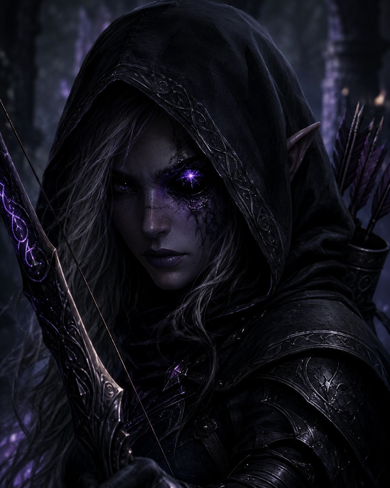

# Zarielle, a Caolha

## Background

Raça: **Meio Drow**

Profissão: **Arqueira**

**Aparência:** Zarielle é uma meio-drow de beleza sombria e presença inquietante. Sua pele possui um tom cinza-azulado profundo, contrastando com os longos cabelos prateados que escapam do capuz negro. Onde antes havia seu olho esquerdo repousa uma pedra negra polida, atravessada por um brilho púrpura sobrenatural que pulsa como se abrigasse uma vontade própria. Seu único olho restante, de um violeta intenso, observa o mundo com frieza e precisão. Veste armadura leve de couro escurecido, adornada por discretos entalhes élficos, sempre envolta em um manto negro que lhe permite desaparecer entre as sombras.

**Personalidade:** Reservada e desconfiada, Zarielle raramente revela seus pensamentos ou emoções. Prefere observar antes de agir e acredita que o silêncio é uma arma tão letal quanto seu arco. A perda do olho e a maldição da pedra ensinaram-lhe a desconfiar até mesmo de si própria, tornando-a cautelosa diante de qualquer manifestação de magia. Apesar da aparência fria, possui um forte senso de justiça e demonstra compaixão pelos perseguidos e marginalizados, talvez por enxergar neles um reflexo de sua própria história. Sua determinação é inabalável, e dificilmente abandona uma missão depois de aceitá-la.

**Motivação:** Zarielle busca descobrir a verdadeira origem da pedra negra incrustada em seu rosto e libertar-se da influência da entidade que parece habitar seu interior. Ao mesmo tempo, procura impedir que esse poder caia nas mãos de feiticeiros ou tiranos capazes de transformar sua maldição em uma arma contra Zandia. Cada ruína antiga explorada e cada segredo desvendado representam um passo em direção à verdade sobre seu passado.

**Breve estória:** 
Filha de uma elfa da superfície e de um drow exilado, Zarielle jamais encontrou um lugar ao qual realmente pertencesse. Rejeitada por ambos os povos, tornou-se uma caçadora e exploradora das regiões mais perigosas de Zandia, sobrevivendo graças à sua habilidade com o arco e à sua capacidade de permanecer invisível aos olhos dos inimigos.

Tudo mudou quando, durante a exploração de um templo soterrado pelas areias, encontrou um antigo artefato de origem desconhecida. Ao tocá-lo, uma pedra negra fundiu-se ao lugar de seu olho esquerdo, consumindo-o para sempre. Desde então, a gema passou a sussurrar fragmentos de conhecimentos esquecidos e visões de um passado remoto, concedendo-lhe poderes extraordinários, mas também ameaçando lentamente corromper sua mente.

Hoje, Zarielle percorre o continente em busca das ruínas da civilização perdida que criou a pedra. Enquanto muitos a veem como uma arqueira misteriosa ou uma assassina das sombras, ela luta diariamente para provar que seu destino será definido por suas próprias escolhas — e não pela escuridão que carrega dentro de si.

## Assinatura

**A Pedra Negra (O olho amaldiçoado):** o olho confere visão aguçada +5, infravisão, visão telescópica+6. Em termos práticos ela ganha um bônus de +5 em qualquer teste de visão, pode ver criaturas de sangue quente perfeitamente no escuro e em combate ignora penalidades de até -6 em ataques a longa distancia (até 20 metros sem penalidade). Se puder mirar pelo menos um turno essa vantagem é dobrada ou seja ignora penalidades até -12 (200 metros)! Não obstante, para cada turno adicional que mirar ganha +1 em precisão até o máximo de +6. O Olho também permite enxergar criaturas invisíveis, no entanto requer uma manobra Preparar para ativar enquanto estiver ativada essa habilidade, o mundo real assume tons escuros e acinzentados. Todos os testes de Visão sofrem uma penalidade de -4.

### Corrupção da pedra

1. **Vozes Diabólicas:** desvantagem concedida pela corrupção da pedra, toda vez que estiver em uma situação estressante o GM rolará 3d6 ou menos; se sair 6 ou menos, vozes em sua cabeça irão sugerir que mate outras pessoas ou cometa atos atrozes, podendo resistir com um teste de vontade. Além disso sempre que falhar num teste de autocontrole de alguma de suas desvantagens ganha 1 ponto de corrupção.
2. **Pesadelos**: desvantagem concedida pela corrupção da pedra,todos os dias deve fazer um teste de autocontrole para não sofrer de pesadelos terríveis causados pela pedra. Se falhar ganha 1 ponto de corrupção.
3. **Excesso de Confiança**, **Solitário** e **Obsessão**, embora essas desvantagens já faziam parte da personalidade de Zarielle elas são agravadas pela pedra. Toda vez que falhar em um teste de autocontrole ganha 1 ponto adicional de corrupção.

A corrupção ganha é aos poucos convertida em pontos negativos que de início irão reduzir o CR das desvantagens de Zarielle mas aos poucos também podem conceder novas pecurialidades e desvantagens tornando-a cada vez mais insana!

Para mais detalhes ver **GURPS Horror (pp. 146-148)**.

## Ficha Completa

<button onclick="document.getElementById('ficha').contentWindow.print();">
🖨️ Imprimir ficha
</button>

    <iframe
        id="ficha"
        src="../../../../assets/fichas/pj/Zarielle.html"
        width="100%"
        max-width: 12000px;
        height="1800"
        style="border:none;">
    </iframe>

