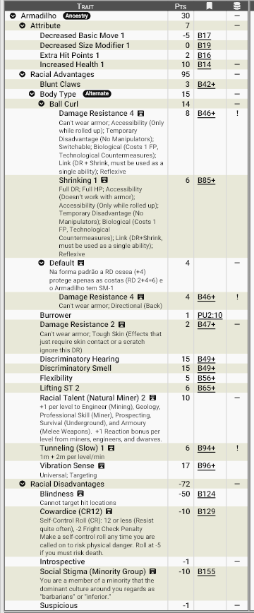

# **Armadilhos, os grande escavadores do Subterrâneo:**

Poucas raças estão tão intimamente ligadas ao mundo subterrâneo quanto os **armadilhos**. Descendentes de antigos tatus-bola que, ao longo de milênios de adaptação, evoluíram para a forma humanoide, eles se tornaram mestres da escavação, da mineração e da sobrevivência em ambientes hostis. Cegos, porém longe de indefesos, aprenderam a perceber o mundo de maneiras que outras espécies mal conseguem compreender. Onde outros enxergam escuridão, os armadilhos sentem vida, movimento e perigo.

Reservados, cautelosos e profundamente pragmáticos, vivem em sociedades que valorizam segurança, estabilidade e conhecimento geológico acima de tudo. Sua reputação como mineradores e engenheiros subterrâneos é lendária, mas poucos povos realmente os conhecem — e menos ainda conquistam sua confiança.

## **Aparência**

Os armadilhos possuem uma silhueta robusta e compacta, com cerca de 1,50 a 1,70 m de altura. Seu corpo mistura características humanoides com traços marcantes de seus ancestrais tatus:

- A pele é grossa e de textura coriácea, variando do marrom-acinzentado ao bege arenoso. 
- A característica mais marcante é a **couraça óssea segmentada**, composta por placas rígidas que cobrem costas, ombros, parte do tórax e o topo da cabeça. Essas placas se sobrepõem como escamas de pedra polida. 
- Seus braços são largos e musculosos, com mãos fortes terminando em **garras espessas e rombas**, perfeitas para escavar e quebrar rocha. 
- O rosto é curto e arredondado, com focinho discreto e narinas largas. Os olhos são vestigiais: pequenos, opacos e praticamente inúteis. 
- As orelhas são discretas, mas extremamente sensíveis a vibrações. 

Quando se sentem ameaçados, podem executar seu movimento mais característico: **encolher-se completamente**, formando uma esfera de placas ósseas quase impenetrável.

## **Fisiologia**

A biologia dos armadilhos é totalmente moldada pela vida subterrânea.

### **Sentidos substitutos**

Por serem cegos, desenvolveram sentidos extraordinários:

- Detectam vibrações no solo com enorme precisão. 
- Sentem mudanças de pressão e temperatura no ar. 
- Conseguem perceber movimentos através da rocha e do solo a vários metros de distância. 

Para um armadilho, o mundo não é escuro — é um mapa vivo de vibrações.

### ***Estrutura corporal***

Seu corpo é construído para suportar esforço constante:

- Ossos densos e flexíveis, capazes de absorver impacto. 
- Músculos adaptados para carga pesada e trabalho contínuo. 
- Metabolismo resistente à poeira, ar pobre em oxigênio e ambientes confinados. 

### **Escavação**

Apesar de não serem rápidos escavadores, são extremamente eficientes e metódicos. Seu ritmo típico é lento, porém constante e seguro, ideal para túneis estáveis e duradouros.

### **Forma de bola**

Seu mecanismo defensivo é uma maravilha evolutiva:

- As placas ósseas se encaixam perfeitamente. 
- Órgãos vitais ficam protegidos no centro. 
- Podem permanecer assim por longos períodos. 

Entretanto, nessa forma ficam imóveis — protegidos, mas incapazes de agir.

## **Psicologia**

A mente armadilha reflete sua biologia. Eles são introvertidos, reservados, desconfiados por natureza e obcecados por segurança. O mundo da superfície é imprevisível, barulhento e perigoso aos seus sentidos. Por isso, armadilhos tendem sempre Evitar riscos desnecessários. 

Eles planejamcuidadosamente antes de agir, valorizando a estabilidade e a rotina. Seu instinto de sobrevivência é tão forte que, diante de perigo súbito, podem automaticamente entrar em posição defensiva, literalmente se encolhendo antes mesmo de pensar.

Apesar disso, entre aqueles que conquistam sua confiança, revelam-se leais. São trabalhadores incansáveis  e surpreendentemente bem-humorados em ambientes seguros.

## **Ecologia**

Armadilhos vivem quase exclusivamente no subterrâneo. Seus assentamentos são cidades escavadas em rocha, sendo complexos sistemas de túneis formando redes de minas antigas e cavernas naturais adaptadas.

Essas comunidades são planejadas com extrema engenharia, priorizando: estabilidade estrutural,  ventilação natural e rotas de fuga múltiplas. Desabamentos são vistos como uma das piores tragédias possíveis.

Fortemente ligados às riquezas minerais, sua economia gira em torno de prospecção e mineração, engenharia subterrânea  e construção de túneis e fortificações. São capazes de identificar minerais com precisão impressionante e localizar veios valiosos com facilidade quase sobrenatural.

## **Relações com Outras Raças**

A relação dos armadilhos com outros povos é complexa. A maioria das raças o vêem como estranhos, reservados  e excessivamente cautelosos Raças mais agressivas como drows e syriianos os veem como covardes por sua tendência defensiva — um erro comum. Anões são uma exceção à regras os considerando grandes parceiros comerciais, um sentimento claramente mútuo.

Para os armadilhos, povos da superfície são impulsivos, barulhentos e imprudentes. Eles respeitam profundamente povos disciplinados, engenheiros e artesãos e aqueles indivíduos que valorizam segurança e planejamento. Apesar da desconfiança inicial, tornam-se aliados valiosos como mineradores, construtores de fortalezas, especialistas em escavações seguras e guias subterrâneos incomparáveis.

Uma vez conquistada sua confiança, um armadilho será um companheiro confiável por toda a vida.

## **Papel em Zandia**

Em Zandia, onde a sobrevivência depende da adaptação a um mundo árido, mágico e imprevisível, os armadilhos encontraram um papel quase indispensável. A terra de desertos, ruínas antigas e cidades-estado erguidas sobre camadas de história é um ambiente que recompensa quem sabe escutar o que existe sob o solo — e nisso poucos se comparam a eles.

Grande parte das rotas comerciais zandianas depende de túneis, cisternas, galerias subterrâneas e minas profundas. A água é mais preciosa que ouro, e muitos dos aquíferos que sustentam cidades inteiras foram descobertos por prospectores armadilhos. Diz-se que, onde um armadilho pisa, ele escuta o sussurro da água muito antes de qualquer outro povo.

Cidades-estado frequentemente mantêm pequenos enclaves armadilhos responsáveis por:

- Escavação de reservatórios subterrâneos 
- Construção de túneis de fuga e passagens secretas 
- Exploração de ruínas soterradas pela areia 
- Avaliação estrutural de construções antigas 
- Prospecção de metais raros e cristais mágicos 
  
Em um mundo onde tempestades de areia podem soterrar vilas inteiras, os armadilhos são vistos como **arquitetos da sobrevivência**.

## **Por que os armadihos se tornam aventureiros?**

Em grupos de aventureiros, armadilhos costumam assumir papéis naturais: exploradores de masmorras e túneis, especialistas em armadilhas e estruturas, guias subterrâneos, engenheiros e construtores, guardiões defensivos e resilientes. Seu instinto de autopreservação não os torna covardes — apenas extremamente conscientes do perigo. Em expedições perigosas, isso frequentemente se traduz em prudência, planejamento e sobrevivência.

Embora sua cultura valorize segurança e estabilidade, Zandia oferece inúmeros motivos para que alguns deixem o conforto do subterrâneo.

Entre os armadilhos, aventureiros costumam surgir como:

### **Prospectores errantes**

Indivíduos fascinados por descobrir novos veios minerais, aquíferos ocultos ou ruínas perdidas. Para eles, o mundo é um mapa incompleto esperando ser escavado.

### **Engenheiros de campo**

Especialistas contratados por expedições, caravanas ou cidades que precisam de alguém capaz de:

- Avaliar estruturas perigosas 
- Abrir passagens 
- Evitar desabamentos 
- Encontrar água ou rotas seguras 

Eles são frequentemente a diferença entre o sucesso e a morte em longas jornadas.

### **Exilados ou inconformistas**

A sociedade armadilha valoriza segurança acima de tudo. Alguns poucos, porém, sentem uma curiosidade inquieta pela superfície — algo visto como estranho, até preocupante. Esses indivíduos acabam deixando suas comunidades em busca de experiências que seus pares considerariam riscos desnecessários.

### **Guardiões da estabilidade**

Alguns veem a exploração como uma missão: impedir que ruínas perigosas, criaturas subterrâneas ou forças antigas ameacem os assentamentos do mundo.

________________________________________

Enfim, companheiros aprendem rapidamente que, quando um armadilho diz que o teto vai cair… é melhor acreditar...

________________________________________

## <u>**Estatística**</u>

### **Modelo Racial**: Armadilho

**Pontuação total**: 30 pontos

!!! info "Considerações sobre a raça:"
    Devido à sua couraça, Armadilhos não podem usar armaduras. Eles podem enrolar-se em bola como uma **Power Dodge** (Powers, p.167). Fora de combate, isso exige uma manobra **Preparar**; em combate, pode ser usado de forma reflexiva como Defesa Ativa, desde que percebam o ataque.
    
    Se falhar no autocontrole de **Covardia**, o Armadilho ativa a forma de bola em 1 turno e permanece assim até a ameaça passar. Ao se enrolar, gasta 1 PF, reduz o tamanho de SM-1 para SM-2 e ganha RD 6 (2+4). Nessa forma não pode se mover (apenas ser empurrado) e nem realizar ações que exijam usar seus quatro membros, mas ainda pode falar e conjurar magias limitadas a palavras ou pensamento.
    
    Ao usar como Power Dodge, faça uma rolagem de ***Esquiva***: sucesso permite encolher-se para longe ou sob o ataque, possibilitando esquivar mesmo quando imobilizado. O Armadilho pode permanecer na forma de bola ou retornar à forma normal com uma manobra Preparar.

**Modificadores de atributos**: HT+3, PV+1, Basic Move-1, SM-1

**Vantagens raciais:**

- Blunt Claws
- Damage Resistance +2 (Can’t wear armor; Tough Skin)+2
- Discriminatory Hearing
- Discriminatory Smell
- Flexibility
- Lifting ST +2
- Racial Talent (Natural Miner) +2
- Tunneling (Slow) +1
- Vibration Sense (Universal; Targeting)

!!! info "Natural Miner ou Minerador Nato"
    
    Armadilhos possuem uma afinidade natural com a vida e o trabalho sob a terra. Recebe +1 por nível em Engineer (Mining), Geology, Professional Skill (Miner), Prospecting, Survival (Underground) e Armoury (Melee Weapons). Recebem um bônus de Reação de +1 por nível de mineradores, engenheiros e anões.

!!! info "Escavação (Lenta)"
    
     Essa é uma versão mais realista de escavação sugerida em Powers, p. 85. Andarilhos escavam a uma velocidade de 1 metro/minuto de escavação usando seu próprio corpo (garras cegas).

**Qualidades (Perks) raciais:**

- Burrower

!!! info "Burrower ou Escavador)"
    
    O Armadilho pode cavar com o próprio corpo como se estivesse equipado com uma pá. Considere essa perk pré-requisito para a vantagem Escavação (Lenta) / Tunneling (Slow).

**Desvantagens raciais:**

- Cowardice(CR 12)
- Social Stigma (Minority Group)

**Pecurialidades (Quirks) raciais:**

- Introspective
- Suspicious

!!! info "Suspicious ou Desconfiado)"
    
    Paranoia em nível de peculiaridade (p. B148). Sua confiança é difícil de conquistar. Mesmo pessoas bem-intencionadas precisam se esforçar mais para superar sua suspeita: apresentar documentos ou fotos, fornecer referências, passar por pequenos testes ou vencer um Teste Rápido de IQ contra você (podem usar uma perícia relevante se for maior — Diplomacia em qualquer situação, Diagnóstico para convencê-lo de que está doente, Forense para validar pistas etc.). Caso contrário, você só acreditará após um interrogatório que rende -1 nas reações… e o Mestre pode aplicar -1 nas reações de quem desperdiçar tempo e dinheiro em excesso, de qualquer forma

#### **Print do GCS:**

________________________________________

Para baixar o arquivo de template do GCS <a href="/assets/gdf/armadilho.gdf" download> 📥 Clique Aqui </a>