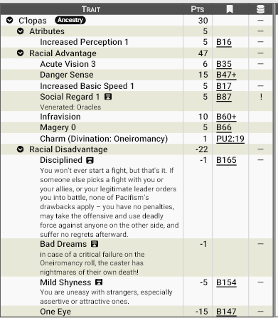

# **Clopas, os filhos dos Ciclopes**

Descendentes distantes dos antigos ciclopes, os C'lopas ou **Clopas** são uma raça rara e profundamente respeitada em Zandia. Conhecidos como visionários e intérpretes de sonhos, carregam uma reputação quase mística entre os povos do deserto. Sua capacidade de praticar oneiromancia — a arte de ler e interpretar sonhos — tornou-os conselheiros naturais de líderes, especialmente dos Arquitetos, que frequentemente buscam sua orientação antes de decisões importantes.

Apesar da aura reverente que os cerca, os C’lopas não são um povo dominante ou expansionista. Pelo contrário, tendem a viver de forma discreta, pacífica e reservada, preferindo observar o fluxo do mundo em vez de moldá-lo diretamente.

## **Aparência**

A característica mais marcante dos C’lopas é o único olho grande e expressivo no centro do rosto, herança direta de seus ancestrais ciclopes. Esse olho possui uma íris de tonalidades incomuns — variando entre âmbar, violeta, azul profundo ou dourado — e frequentemente reflete a luz como se houvesse algo sobrenatural por trás dele.

Fisicamente, são humanoides altos e esguios, com membros longos e postura naturalmente ereta. Sua pele costuma apresentar tons arenosos, acinzentados ou levemente azulados, adaptados ao ambiente árido de Zandia. Seus cabelos tendem a ser finos e claros, muitas vezes mantidos longos e soltos.

Suas expressões faciais são sutis e difíceis de interpretar, reforçando a impressão de constante contemplação.

## **Fisiologia**

A fisiologia dos C’lopas é otimizada para percepção e sobrevivência em ambientes hostis.

Seu único olho possui capacidades sensoriais excepcionais, permitindo visão aguçada, percepção de calor e uma sensibilidade incomum a movimentos e ameaças. Essa combinação lhes concede uma percepção quase sobrenatural do perigo iminente.

Magicamente, todos os C’lopas possuem uma centelha inata de talento arcano. Mesmo aqueles que nunca estudam magia formalmente demonstram afinidade com fenômenos sobrenaturais, especialmente ligados aos sonhos e à intuição.

No entanto, sua ligação com o mundo onírico tem um custo: sonhos intensos e, por vezes, perturbadores fazem parte constante de suas vidas. Alguns C’lopas relatam visões que misturam passado, presente e futuros possíveis, o que pode causar fadiga mental e episódios de ansiedade.

## **Psicologia**

Clopas são naturalmente disciplinados, reservados e introspectivos. Evitam conflitos sempre que possível e dificilmente iniciam confrontos físicos. Não por covardia, mas por enxergarem a violência como sinal de falha na previsão e na compreensão dos acontecimentos.

Sua timidez é notória, especialmente diante de estranhos ou indivíduos muito assertivos. Em ambientes sociais, tendem a falar pouco, escolhendo cuidadosamente cada palavra.

Por outro lado, quando a situação exige — seja para proteger aliados ou cumprir ordens legítimas — são capazes de agir com determinação fria e eficiência surpreendente. Após a ação, raramente demonstram arrependimento: para eles, o conflito inevitável já foi aceito muito antes de acontecer.

## **Ecologia**

Os Clopas preferem assentamentos pequenos e isolados, geralmente próximos a formações rochosas ou regiões elevadas, onde o horizonte é amplo e os céus são visíveis. A vastidão do deserto é vista como essencial para a clareza dos sonhos e visões.

Vivem de forma simples e sustentável, com pouca intervenção no ambiente. Suas comunidades são silenciosas, contemplativas e marcadas por rotinas regulares de meditação, estudo e interpretação de sonhos coletivos.

## **Relações com Outras Raças**

Entre os povos de Zandia, os Clopas são amplamente respeitados — às vezes até venerados. Sua reputação como oráculos lhes concede um raro tipo de prestígio social baseado não em poder militar ou riqueza, mas em sabedoria.

Arquitetos frequentemente mantêm Clopas como conselheiros, e governantes costumam oferecer abrigo e proteção em troca de orientação profética. Entretanto, essa reverência também cria distância. Muitos os veem como enigmáticos demais para amizade verdadeira, o que reforça seu isolamento cultural.

## **Papel em Zandia**

Em Zandia, os Clopas ocupam o papel de observadores do destino.

Eles não governam cidades nem lideram exércitos, mas influenciam decisões que moldam civilizações. Uma única interpretação de sonho pode alterar planos de guerra, fundações de cidades ou expedições ao deserto.

Para muitos, os Clopas são a consciência silenciosa do mundo — aqueles que enxergam ecos do futuro nos sonhos do presente.

## **Por que os clopas se tornam aventureiros?**

Para um povo contemplativo, reservado e profundamente ligado aos sonhos, tornar-se aventureiro é uma escolha incomum — quase sempre motivada por presságios, dever ou necessidade espiritual. Quando um Clopas deixa sua comunidade para trilhar o caminho da aventura, isso raramente é impulsivo: é visto como parte de algo maior.

### **Chamado profético**

O motivo mais comum é simples e poderoso: eles sonharam com isso. Visões recorrentes, sonhos simbólicos ou presságios inquietantes podem indicar que determinado lugar, pessoa ou evento exige sua presença. Para os C’lopas, ignorar tais sinais seria irresponsável — ou até perigoso. Um aventureiro Clopas muitas vezes acredita que sua jornada já começou nos sonhos muito antes de partir fisicamente.

### **Missão como conselheiro itinerante**

Arquitetos, governantes e líderes frequentemente solicitam a presença de C’lopas fora de seus assentamentos. Alguns tornam-se conselheiros viajantes, acompanhando expedições, caravanas ou grupos de aventureiros para interpretar sinais, prever perigos e orientar decisões críticas. Nesses casos, o Clopas não vê a si mesmo como herói, mas como guia do destino do grupo.

### **Busca por significado das próprias visões**

Nem todas as visões são claras. Muitos Clopas têm sonhos fragmentados, perturbadores ou contraditórios. Aventurar-se pode ser a única forma de compreender essas imagens — encontrar lugares vistos em sonhos, pessoas desconhecidas que parecem familiares ou eventos que parecem inevitáveis. A jornada torna-se uma investigação espiritual.

### **Proteção preventiva do futuro**

Por acreditarem que a violência é sinal de falha na previsão, alguns Clopas viajam justamente para evitar tragédias antes que aconteçam.
Eles podem juntar-se a aventureiros para impedir guerras, impedir expedições condenadas ou intervir em eventos que perceberam como pontos críticos do destino.

### **Serviço e dívida com outras culturas**

Como recebem respeito, abrigo e proteção de muitas sociedades, alguns Clopas sentem obrigação moral de retribuir. Aventurar-se ao lado de outros povos pode ser visto como serviço, aprendizado ou pagamento de dívidas culturais.

### **Exílio silencioso ou sonhos perigosos demais**

Certas visões são perturbadoras demais para serem ignoradas — ou perigosas demais para permanecer dentro da comunidade. Um Clopas que sonha repetidamente com destruição, morte ou presságios de calamidade pode partir voluntariamente, buscando respostas longe de casa para proteger seu povo do peso dessas visões.

________________________________________

**Em resumo:** um aventureiro Clopas raramente busca glória ou riqueza. Ele viaja porque acredita que o destino o chamou — e porque ignorar um sonho pode ser mais perigoso do que enfrentá-lo.

________________________________________

## <u>**Estatística**</u>

### **Modelo Racial**: Clopas

**Pontuação total**: 30 pontos

!!! info "Considerações sobre a raça:"
    Clopas são uma raça venerada por serem considerados oráculos, adivinhos, visionários; muitos alcançam a posição de conselheiros entre os lideres de outras raças, em especial nas cidades governadas pelos Arquitetos. 
    
    Em caso de falha crítica no teste de Oneiromancia, o Clopas terá pesadelos com a própria morte!

**Modificadores de atributos**: Per+1, Basic Speed+0.25

**Vantagens raciais:**

- Acute Vision+3
- Danger Sense
- Infravision
- Magery 0
- Social Regard (Venerated: Oracle)+1

**Qualidades (Perks) raciais:**

- Charm (Divination: Oneiromancy)

**Desvantagens raciais:**

- Mild Shyness(CR 12)
- One Eye

**Pecurialidades (Quirks) raciais:**

- Disciplined
- Bad Dreams

!!! info "Disciplined ou Disciplinado)"
    
    Um Clopas nunca iniciará uma briga — e só. Se outra pessoa começar uma luta contra você ou seus aliados, ou se seu líder legítimo ordenar que você entre em combate, nenhuma das desvantagens de Pacifismo se aplica: você não sofre penalidades, pode partir para a ofensiva e usar força letal contra qualquer inimigo, sem remorso depois.

#### **Print do GCS:**

________________________________________

Para baixar o arquivo de template do GCS <a href="/assets/templates/clopas.gct" download> 📥 Clique Aqui </a>