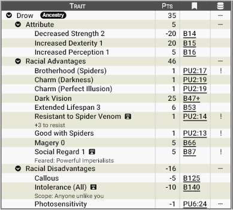

# **Drows, os conquistadores das profundezas:**

Os **drows** são uma raça aparentada aos elfos que abandonou a superfície há incontáveis eras para conquistar o mundo subterrâneo de Zandia. Temidos, supremacistas e profundamente cruéis, eles construíram uma civilização baseada na escravidão e na dominação absoluta. No coração de sua fé está **Xilthara**, a Rainha Aranha das Dunas, uma divindade que representa astúcia, veneno, paciência e poder implacável. A sociedade drow é rigidamente matriarcal, e seu nome é sussurrado com medo entre os povos da superfície.

## **Aparência**

Os drows possuem pele em tons escuros que variam do cinza grafite ao negro profundo, muitas vezes com reflexos azulados ou violáceos sob a luz. Seus cabelos são normalmente brancos, prateados ou extremamente pálidos, criando um contraste marcante com a pele. Seus olhos brilham em cores intensas — vermelho, lilás, âmbar ou branco leitoso — adaptados à escuridão eterna de seus domínios. São esguios, elegantes e de beleza fria, quase alienígena, com traços delicados que escondem sua natureza predatória.

## **Fisiologia**
Adaptados à vida subterrânea, os drows possuem visão excepcional na escuridão e grande sensibilidade à luz intensa da superfície, que pode cegá-los temporariamente. Seu metabolismo é eficiente e resistente a venenos de aranhas, resultado de séculos convivendo com essas criaturas. Sua longevidade rivaliza a dos elfos, mas seu crescimento é moldado por ambientes brutais, tornando-os fisicamente ágeis, silenciosos e resistentes. 

## **Psicologia**
A cultura drow cultiva ambição, astúcia e desconfiança como virtudes. Desde cedo, aprendem que poder é a única segurança real. Relações são frequentemente utilitárias, e traição é vista como uma ferramenta legítima quando executada com sucesso. A fé em Xilthara reforça a ideia de que a vida é uma teia onde apenas os mais inteligentes e cruéis prosperam. Apesar disso, lealdade pode existir — mas geralmente apenas à casa matriarcal, à deusa e à sobrevivência da própria raça.

## **Ecologia**

Os drows habitam vastas cidades subterrâneas esculpidas em cavernas colossais, iluminadas por fungos luminescentes e cristais mágicos. Criam ecossistemas artificiais baseados em fungos, insetos gigantes, lagartos e criaturas adaptadas ao subsolo. Caçam, cultivam e escravizam para manter sua sociedade. Expedições à superfície são comuns para capturar prisioneiros, adquirir recursos raros e espalhar medo.

Drows consideram as aranhas criaturas sagradas, filhas de Xilthara. Eles são bem próximos, tendo uma forte empatia com elas, quase uma relação simbiótica: desde que o drow não as ataquem elas considerarão que é parte de seu “ninho”! 

## **Relações com Outras Raças**

Para os povos da superfície, drows são invasores noturnos, sequestradores e conquistadores. Muitas culturas contam histórias de vilas inteiras desaparecendo após incursões vindas das profundezas. Sua sociedade escravista captura povos da superfície para trabalho, guerra ou sacrifício, e os drows enxergam as demais raças como inerentemente inferiores — uma visão supremacista profundamente enraizada em sua cultura.

Ainda assim, o medo que inspiram vai além do terror comum. Drows são reconhecidos como uma das potências mágicas e militares mais perigosas de Zandia, e sua presença impõe respeito imediato, em especial entre os humanos magos que governam as Cidades-Estado. Povos que os odeiam preferem cautela ao confronto aberto, reagindo com deferência silenciosa e evitando provocar sua ira.

Entre todas as nações, apenas os drows são vistos como capazes de oferecer verdadeira resistência aos **Arquitetos**. Isso criou uma relação tensa de equilíbrio e dissuasão, quase uma guerra fria: nenhuma das partes confia na outra, mas ambas reconhecem o custo devastador de um conflito direto. Como resultado, não é incomum haver diplomatas drows nas cidades-estado da superfície, oficialmente enviados para manter relações e tratados — embora seja amplamente aceito que espionagem e jogos de poder caminham lado a lado com essas “boas relações”.

Assim, drows não são recebidos com amizade ou calor, mas com cautela, respeito e o entendimento de que provocar esse povo pode ter consequências catastróficas.

## **Papel em Zandia**

Em Zandia, os drows representam uma ameaça constante e silenciosa. São conquistadores nas sombras, arquitetos de conspirações e mestres da guerra subterrânea. Seu império invisível cresce lentamente sob os pés das civilizações da superfície. Para muitos, a pergunta não é se os drows emergirão em grande escala — mas quando.

## **Por que drows se tornam aventureiros?**
Apesar de sua sociedade ser poderosa, estruturada e profundamente coletiva, a vida drow é brutal, competitiva e implacável. Em Zandia, tornar-se aventureiro não é comum — mas quando acontece, quase sempre existe um motivo forte, perigoso ou desesperado por trás.

### **Ascensão pessoal e ambição extrema**

A sociedade drow recompensa poder acima de tudo. Casas matriarcais disputam status de forma constante, e indivíduos são criados para competir desde cedo. Aventurar-se na superfície pode ser visto como um caminho para conquistar prestígio, artefatos raros, magia perdida ou alianças estratégicas. Um drow que retorna com poder tangível pode subir rapidamente na hierarquia — se sobreviver tempo suficiente para voltar.

### **Missões oficiais das casas e da fé de Xilthara**

Muitos drows aventureiros não são “independentes”, mas agentes enviados deliberadamente. Podem atuar como:
- Espiões nas cidades-estado da superfície 
- Diplomatas informais ou manipuladores políticos 
- Caçadores de relíquias antigas 
- Executores de objetivos secretos da Rainha Aranha 

Para a sociedade drow, grupos de aventureiros são ferramentas úteis: pequenos, discretos e plausivelmente negáveis.

### **Exílio, fracasso ou punição**

Falhar na sociedade drow raramente é perdoado. Intrigas internas geram perdedores — e nem todos são executados. Alguns são exilados, outros fogem antes de serem mortos. Esses drows tornam-se aventureiros por necessidade: sobreviver fora do império subterrâneo é a única alternativa ao retorno e à morte.

### **Curiosidade proibida e ruptura cultural**

Embora raros, existem drows que questionam sua cultura. Expostos a ideias da superfície — compaixão, liberdade, cooperação — alguns desenvolvem conflitos internos. Esses indivíduos podem tornar-se aventureiros como forma de descobrir o mundo, fugir da opressão cultural ou encontrar um novo propósito. Para sua própria raça, são traidores ou anomalias.

### **Agentes de longo prazo da expansão drow**

Alguns drows operam por décadas entre povos da superfície. Eles aprendem idiomas, constroem reputações e criam redes de influência. Mesmo quando parecem heróis ou mercenários comuns, podem estar preparando o terreno para objetivos maiores: rotas de invasão, chantagens políticas, sabotagem econômica ou aquisição de conhecimento estratégico.

### **Busca por recursos que o subterrâneo não possui**

O mundo subterrâneo é rico em magia e criaturas estranhas, mas pobre em certos recursos. Metais raros, relíquias antigas, grimórios esquecidos, artefatos solares e alianças com magocracias da superfície são valiosos demais para ignorar. Aventurar-se torna uma extensão natural das necessidades do império.
________________________________________

**Em resumo:** um drow aventureiro nunca é casual. Ele é, quase sempre, um instrumento de ambição, sobrevivência, fé, exílio ou conspiração — e raramente apenas um viajante em busca de glória.

________________________________________

## <u>**Estatística**</u>

### **Modelo Racial**: Drow

**Pontuação total**: 35 pontos

**Modificadores de atributos**: ST-2, DX-1, PER+1

**Vantagens raciais:**

- Dark Vision
- Extended Lifespan +3
- Social Regard: Feared (Powerfull Imperialist)

**Qualidades (Perks) raciais:**

- Brotherhood (Spiders) / Irmandade (Aranhas) 
- Charm (Darkness) / Dom mágico (Trevas)
- Charm (Perfect Illusion) / Dom mágico (Ilusão Perfeita)
- Good with Spiders / Empatia com aranhas
- Resistant to Spider Venom (+3 to Resist) / Resistência a venenos (+3 em teste de resistência)

!!! info "Brotherhood ou Irmandade (Aranhas)"
    
    Aranhas não necessariamente gostam de você, mas o ignoram se você não for hostil e estiver visível. Elas o empurram para o lado para alcançar presas ou objetivos. Se você interferir ou agir com hostilidade, passa a ser considerado um alvo válido. Em resposta ao respeito demonstrado, tendem a reagir de forma neutra ou favorável, exceto quando possuem comportamento predeterminado ou estão sob controle sobrenatural.

**Desvantagens raciais:**

- Callous / Indiferente
- Intolerance (All) / Intolerância (Todos)

**Pecurialidades (Quirks) raciais:**

- Photosensitivity / Fotosensibilidade

!!! info "Fotosensibilidade"
    
    Seus olhos são incomumente sensíveis à luz. Você recebe -1 em testes de HT para resistir a efeitos ofuscantes (granadas de luz, magias de Flash etc.). Se sofrer ao menos -1 em Visão devido à luz intensa, aplique mais -1; se a penalidade total chegar a -10, você fica efetivamente cego.

#### **Print do GCS:**

________________________________________

Para baixar o arquivo de template do GCS <a href="/assets/templates/drow.gct" download> 📥 Clique Aqui </a>
