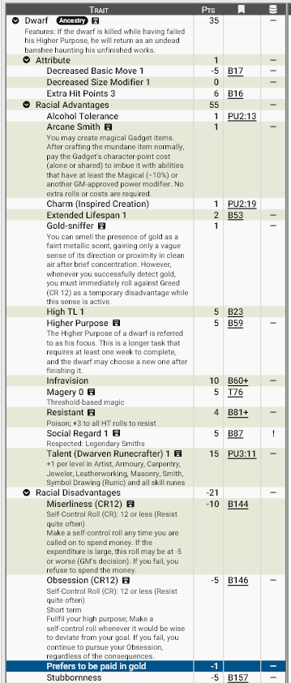

# **Anões, os artífices de Zandia:**

Os **anões** são uma das colunas invisíveis que sustentam a civilização de Zandia. Em um mundo onde a magia é perigosa e instável, eles descobriram uma forma segura de aprisioná-la: as runas. Essa arte milenar permite transformar objetos comuns em artefatos mágicos estáveis, tornando os anões indispensáveis para magos, governantes e guildas.

A reputação de **Ferreiros Arcanos Lendários** não é exagero. Em Zandia, praticamente todo artefato mágico confiável tem origem anã.

## **Aparência**

Anões são baixos, compactos e densos — como se tivessem sido talhados da própria rocha.
Traços comuns:

- Corpo robusto e musculatura compacta 
- Movimento mais lento, porém firme e resistente 
- Barbas longas e cuidadosamente mantidas (símbolo de honra) 
- Mãos grandes e extremamente precisas 
- Olhos adaptados ao calor das forjas e à penumbra subterrânea (visão infravermelha) 

Eles parecem feitos para resistir, durar e suportar.

## **Fisiologia**

O corpo anão é moldado para sobrevivência e trabalho extremo.

Traços fisiológicos importantes:

- Maior resistência física e pontos de vida acima da média 
- Longevidade estendida 
- Alta resistência a venenos 
- Tolerância excepcional ao álcool 
- Visão no espectro infravermelho 
- Movimento naturalmente mais lento que outras raças 

Seu metabolismo parece feito para ambientes hostis e trabalhos extenuantes.

## **Psicologia**

A mente anã gira em torno de propósito, criação e acumulação.

Traços psicológicos principais:

- Teimosia lendária 
- Forte tendência à avareza 
- Obsessão por um **Propósito Superior**
- Dificuldade em gastar dinheiro
- Preferência cultural por pagamento em ouro
- Fascínio quase instintivo por riquezas 

Todo anão vive orientado por um **foco**: um grande objetivo criativo ou profissional que pode levar anos ou décadas.

### **Cultura e Propósito (Higher Purpose)**

Todo anão possui um Foco — um objetivo de longo prazo que define sua vida.
Exemplos:

- Forjar a arma perfeita 
- Construir uma fortaleza eterna 
- Criar um artefato lendário 
- Descobrir uma nova técnica rúnica 

Se morrerem sem cumprir esse propósito, acredita-se que seu espírito retorna como uma assombração presa à obra inacabada.
Isso torna o fracasso algo profundamente temido.
________________________________________

### **Magia Rúnica e Ferreiros Arcanos**

Anões são exímios Ferreiros Arcanos possuindo um talento natural para runas e artesanato.  Essa técnica é exclusiva e guardada com extremo segredo. 

Essa habilidade única permite criar gadgets mágicos rúnicos. Eles encantam itens após a criação mundana, pagando o custo mágico em esforço e conhecimento e, assim, criam artefatos mais seguros que magia convencional.

## **Ecologia**

Os anões vivem onde há pedra, metal e profundidade.

Ambientes típicos:

- Montanhas e cadeias rochosas 
- Complexos subterrâneos 
- Minas profundas 
- Fortalezas escavadas 

Eles possuem uma habilidade curiosa: conseguem sentir o cheiro do ouro, percebendo sua presença como um leve aroma metálico no ar. Isso moldou toda sua economia e expansão territorial.

## **Relações com Outras Raças**

Há um profundo respeito mútuo entre magos e os anões. Os magos precisam dos anões para criar artefatos mágicos estáveis. Por outro lado, anões dependem de muitos ingredientes mágicos coletados e produzidos por magos. Principalmente nas regiões controladas pela humanidade (e Arquitetos), há um relação comercial intensa. As cidades-estado dependem do aço anão para guerras e construção.

Em relação a outras raças há uma mistura de respeito e irritação. Anões veem outros povos como impulsivos e irresponsáveis, principalmente os Elfos cinzentos e os Tressis. Anões não confiam em drows: o histórico de guerras,  disputas territoriais e os seculos de hostilidades entre os dois povos torna dificil qualquer aproximação.

Possuem uma excelente relação com os **Armadilhos**, devido ao fato dos seus interesses serem comuns. Na realidade anões e armadilhos possuem uma relação quase simbiótica: com seu conhecimento na construção de tuneis seguros para mineração, armadilhos oferecem uma maneira fácil de anões coletarem os minérios que precisam para construir suas criações. Em troca, além de auxiliar no trabalho das minas, anões oferecem ferramentas mundanas e arcanas úteis para os armadilhos no seu trabalho ou na vida cotidiana.

Enfim, mesmo sem dominar territórios vastos, a influência dos anões é imensa, tanto nos territorios das cidades-estado dominadas pelos Arquitetos, quanto nos terras desoladas do deserto controladas pelas demais raças.

## **Papel em Zandia**

Sem os anões, Zandia regrediria séculos.

Eles são:

- Os últimos mestres do aço de qualidade 
- Criadores de artefatos mágicos estáveis 
- Líderes da Guilda de Artesãos 
- Influentes no Conselho dos Arquitetos 
- Base econômica e militar indireta do mundo 

Os anões não governam impérios — mas todos os impérios dependem deles.

## **Por que os anões se tornam aventureiros?**

Para os anões, a vida é guiada por propósito. Diferente de outras raças que buscam fama ou liberdade, um anão raramente abandona sua forja sem uma razão poderosa. Quando um anão se torna aventureiro, quase sempre isso está diretamente ligado ao seu **Foco** — o propósito maior que define sua existência.

### **Busca por materiais raros e impossíveis**

Runas exigem matérias-primas excepcionais: metais perdidos, cristais mágicos, artefatos antigos, ligas esquecidas. Muitas dessas riquezas existem apenas em ruínas, desertos distantes ou territórios perigosos.
Um anão aventureiro frequentemente está em expedição para obter os componentes necessários para criar sua grande obra.

### **Cumprir o Foco pessoal**

Todo anão possui um objetivo de vida: forjar a arma perfeita, descobrir uma nova técnica rúnica, construir uma fortaleza eterna ou criar um artefato lendário.
Aventurar-se é, muitas vezes, parte inevitável desse caminho. Se o propósito exige viajar, enfrentar perigos ou explorar ruínas antigas, o anão irá fazê-lo sem hesitar — pois morrer sem cumprir o Foco é um destino temido até após a morte.

### **Recuperar heranças anãs perdidas**

Relíquias rúnicas antigas, fortalezas abandonadas e minas esquecidas são obsessões culturais. Um anão pode aventurar-se para recuperar armas ancestrais, livros de runas perdidos ou locais históricos tomados por monstros e saqueadores.

### **Missões das guildas e contratos comerciais**

A economia de Zandia depende dos anões. Guildas frequentemente enviam representantes em caravanas, expedições e missões diplomáticas para proteger interesses comerciais, avaliar recursos minerais ou garantir rotas seguras. Esses anões são aventureiros por dever profissional.

### **Proteção do segredo rúnico**

A magia rúnica é um segredo guardado com extremo cuidado. Quando surgem rumores de roubo de técnicas, falsificações ou uso indevido de artefatos rúnicos, anões podem ser enviados para investigar — e eliminar a ameaça, se necessário.

### **Ganância e fascínio por riqueza**

Embora disciplinados, anões possuem uma atração instintiva por ouro e tesouros. Ruínas antigas, cidades soterradas e cofres esquecidos exercem um chamado poderoso. Muitos aventureiros anões começam suas jornadas por oportunidades que prometem grandes riquezas — e permanecem nelas por causa do que essas riquezas permitem criar.

### **Exílio, falha ou vergonha** ###

Nem todos cumprem seu propósito com sucesso. Um projeto fracassado, dívida com guildas ou erro grave pode levar um anão a deixar sua comunidade em busca de redenção. Aventurar-se torna-se uma forma de recuperar honra e provar seu valor.

________________________________________

**Em resumo:** um anão não abandona a segurança da pedra por impulso. Ele viaja porque precisa — para criar, recuperar, proteger ou cumprir o propósito que dá sentido à sua vida.

________________________________________

## <u>**Estatística**</u>

### **Modelo Racial**: Anão

**Pontuação total**: 35 pontos

!!! info "Considerações sobre a raça:"
    A magia **Inspired Creation** não está contabilizada no modelo racial devendo ser comprada à parte. 
    
    O **Propósito Maior** de um anão é chamado de seu **foco**. Trata-se de uma tarefa mais longa que requer pelo menos uma semana para ser concluída, e o anão pode escolher um novo foco após terminá-la. Se o anão for morto enquanto não cumprir seu propósito maior, ele retornará como uma assombração preso ao assunto não concluído. <u>**Um PJ que se transformar em uma assombração automaticamente se converterá em NPC**</u>.

**Modificadores de atributos**: HP+3, Basic Move-1, SM-1

**Vantagens raciais:**

- Extended Lifespan+2
- High TL+1
- Infravision
- Magery 0
- Resistant (Poison)+3
- Social Regard: Respect (Legendary Smiths) +1
- Talent (Runecrafter) +1

!!! info "Runecrafter ou Artífice de Runas"
    
    Esse talento confere +1 por nível em Artist, Armoury, Carpentry, Jewerly, Leatherwork, Masonry, Smith, Symbol Drawing (Runes) e todas as pericias de runas específicas. Bônus de reação: +1 por nível para trabalhadores em projetos e de possíveis empregadores.

**Qualidades (Perks) raciais:**

- Alcohol Tolerance
- Arcane Smith
- Charm: Inspired Creation
- Gold Sniffer

!!! info "Arcane Smith ou Ferreiro Arcano)"
    
    O Anão pode criar itens Gadget mágicos. Após fabricar o item mundano normalmente, pague o custo em pontos de personagem do Gadget (sozinho ou compartilhado) para imbuí-lo com habilidades que tenham pelo menos o modificador Magical (−10%) ou outro modificador de poder aprovado pelo Mestre. Os itens são encantados usando regras para **Encantamento com Runas**.

!!! info "Gold Sniffer ou Farejador de ouro)"
    
    O anão consegue sentir o cheiro da presença de ouro como um leve odor metálico, obtendo apenas uma noção vaga de sua direção ou proximidade em ar limpo após breve concentração. No entanto, sempre que detectar ouro com sucesso, ele deve imediatamente fazer um teste contra Greed/Cobiça (CR 12) como uma desvantagem temporária enquanto esse sentido estiver ativo.

**Desvantagens raciais:**

- Miserliness(CR 12)
- Obsession: Fulfill your high purpose (CR 12)
- Stubbornness

**Pecurialidades (Quirks) raciais:**

- Prefers to be paid in gold

#### **Print do GCS:**

________________________________________

Para baixar o arquivo de template do GCS <a href="/assets/templates/dwarf.gct" download> 📥 Clique Aqui </a>