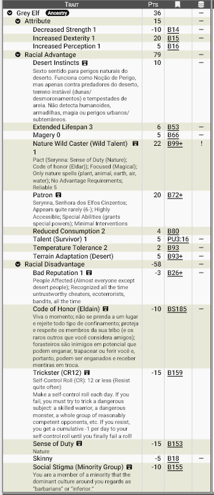

# Elfos Cinzentos, os Guardiões de um Mundo Perdido

Muito antes das areias engolirem os continentes e da magia ser marcada pelo Cataclisma, os elfos governavam um império de florestas intermináveis, rios cristalinos e cidades vivas moldadas em perfeita harmonia com a natureza. Eram uma raça quase imortal, profundamente conectada ao mundo natural e protegida pela graça de **[Serynna](../religiao/patronos.md/#serynna-senhora-dos-elfos-cinzentos)**, o Grande Espírito da Vida.

Quando Zandia foi devastada, esse mundo desapareceu.

As florestas tornaram-se desertos, os rios secaram e o antigo império élfico foi reduzido a ruínas soterradas pelas dunas. Os próprios elfos mudaram. Sua longevidade foi reduzida, parte de sua antiga grandeza desapareceu e sua ligação com a natureza tornou-se uma luta constante para preservar os últimos vestígios de vida existentes.

Hoje são conhecidos como **Elfos Cinzentos**, um nome dado tanto pela fina camada de poeira que constantemente cobre suas vestes e pele quanto pela melancolia que parece acompanhá-los desde a queda de sua civilização. Vivem como nômades, seguindo as rotas dos oásis e das migrações animais, recusando-se a construir cidades permanentes que possam novamente ser destruídas pelo mundo.

Apesar de muitos povos enxergarem os elfos como ladrões, trapaceiros ou fanáticos da natureza, poucos compreendem que eles se consideram os últimos guardiões de um mundo que praticamente deixou de existir.

---

## Aparência

Os Elfos Cinzentos mantêm a elegância característica de seus ancestrais, embora agora ela seja moldada pelas exigências da sobrevivência.

São mais altos que a maioria dos humanos, geralmente entre **1,75 e 1,95 metros**, possuindo corpos extremamente magros e musculatura discreta. A vida no deserto elimina qualquer excesso de peso, conferindo-lhes uma aparência quase frágil, embora esconda uma impressionante resistência física.

Sua pele varia entre tons acinzentados, bronzeados claros e ocres, constantemente coberta por uma fina camada de poeira e areia que parece fazer parte de sua própria aparência. Muitos utilizam pigmentos naturais para quebrar o brilho da pele e facilitar a camuflagem entre rochas e dunas.

Os cabelos costumam ser longos, usados em tranças ou presos para evitar o calor. As cores variam entre branco, cinza-prateado, castanho claro e tons arenosos. Cabelos negros são extremamente raros.

Os olhos são talvez sua característica mais marcante. Herdaram dos antigos elfos uma grande variedade de cores incomuns — verde-esmeralda, âmbar, azul profundo, dourado ou violeta — frequentemente com um brilho discreto quando utilizam magia.

Suas orelhas permanecem longas e delicadas, capazes de captar sons extremamente sutis, movendo-se levemente conforme a direção dos ruídos.

As roupas são leves, compostas por tecidos naturais, couro curtido e mantos destinados a proteger tanto do sol quanto das tempestades de areia. Diferentemente dos humanos, raramente utilizam armaduras metálicas pesadas, preferindo equipamentos que não limitem seus movimentos.

---

##  Fisiologia

Embora tenham perdido sua antiga imortalidade, os Elfos Cinzentos continuam sendo biologicamente muito diferentes dos humanos.

Seu metabolismo é extremamente eficiente, necessitando de pouca água e alimento para sobreviver durante longas jornadas. São capazes de percorrer enormes distâncias sob calor intenso sem apresentar sinais evidentes de exaustão.

Vivem, em teoria, até **800 anos**, embora poucos alcancem tal idade. A violência do deserto faz com que a maioria morra antes dos **400 anos**.

Sua audição, visão e percepção ambiental são superiores às humanas. Muitos afirmam que um elfo é capaz de perceber uma tempestade de areia horas antes de sua formação, identificar mudanças na direção dos ventos ou encontrar água onde outros enxergariam apenas rochas.

Essa percepção quase sobrenatural tornou-se conhecida como o **Instinto do Deserto** — uma habilidade impossível de explicar completamente. Alguns estudiosos acreditam tratar-se de uma forma inconsciente de sensibilidade mágica.

Todos os Elfos Cinzentos possuem ainda uma afinidade natural com a magia ligada aos aspectos vivos do mundo, um dom concedido por sua "deusa". Seu talento manifesta-se principalmente através das esferas de:

- Animais
- Plantas
- Água
- Terra
- Clima

Mesmo aqueles que jamais estudam magia conseguem sentir alterações no fluxo mágico ao seu redor, percebendo áreas corrompidas, encantamentos ou fenômenos sobrenaturais com muito mais facilidade que outras raças.

Fisicamente, porém, continuam menos robustos que os humanos. Possuem menor força muscular, compensando essa limitação com velocidade, agilidade e precisão excepcionais.

---

## Psicologia

A queda do império transformou profundamente a mentalidade élfica. Os Elfos Cinzentos vivem intensamente o presente. Para eles, nada no mundo é permanente. Cidades desaparecem, impérios ruem e até florestas podem tornar-se desertos.

Essa filosofia produz indivíduos espontâneos, adaptáveis e pouco apegados a posses materiais. A liberdade ocupa um lugar quase sagrado em sua cultura.

Eles evitam permanecer muito tempo em um mesmo lugar, recusam qualquer forma de servidão e demonstram profundo desconforto diante de muralhas, prisões ou estruturas que limitem seus movimentos. Essa aversão não chega a constituir uma fobia incapacitante, mas é suficiente para fazer muitos elfos evitarem cidades subterrâneas, fortalezas fechadas ou longas permanências em ambientes confinados.

A lealdade, entretanto, é absoluta quando direcionada à própria tribo. Trair companheiros é considerado uma das maiores desonras possíveis. No entanto, isso não se replica as demais raças...

Todo Elfo Cinzento nasce também com um profundo **Senso do Dever** para com a natureza. Proteger fontes de água, preservar animais e impedir a destruição dos poucos ecossistemas restantes não é apenas uma escolha moral, mas parte de sua identidade.

Esse compromisso é acompanhado por um rígido **Código de Honra**, resumido em três princípios fundamentais:

- **Viver livre**, sem aceitar correntes, servidão ou confinamento permanente.
- **Viver o presente**, sem apegar-se excessivamente a posses materiais ou lugares fixos.
- **Ser leal à própria tribo**, colocando seu bem-estar acima dos interesses individuais.

Esses valores fazem com que muitos elfos sejam vistos como imprevisíveis ou até rebeldes pelos povos civilizados. Para um elfo, entretanto, obedecer cegamente às leis de um reino nunca pode ser mais importante do que proteger a natureza ou honrar sua tribo.

---

## Ecologia

Os Elfos Cinzentos vivem em perfeita simbiose com o deserto. Suas tribos percorrem rotas migratórias conhecidas apenas por eles, acompanhando chuvas sazonais, flora efêmera e rebanhos selvagens. Ao contrário dos humanos, raramente extraem da natureza mais do que o necessário.

Sempre que possível eles ocultam fontes de água, protegem oásis e dispersam sementes. Elfos auxiliam na recuperação de áreas degradadas e controlam populações de predadores quando ameaçam o equilíbrio local.

Seu conhecimento sobre plantas medicinais, ervas venenosas e animais do deserto é praticamente incomparável. Muitos acreditam que determinadas regiões áridas continuam habitáveis apenas graças à intervenção silenciosa de tribos élficas.

Sua religião gira em torno de **Serynna**, outrora uma poderosa entidade da natureza. Assim como seus seguidores, ela perdeu grande parte de seu esplendor após o desaparecimento das florestas, tornando-se um espírito adaptado às paisagens áridas. Para os elfos, o deserto não representa a morte da natureza, mas apenas uma nova forma de vida que merece ser compreendida e protegida.

---

## Relações com Outras Raças

### Humanos

As relações costumam ser tensas. Os humanos frequentemente enxergam os Elfos Cinzentos como ladrões, contrabandistas ou saqueadores de caravanas.

Embora alguns grupos realmente sobrevivam atacando exploradores que consideram invasores, a maioria simplesmente evita o contato sempre que possível. Em contrapartida, muitos elfos consideram os humanos excessivamente ambiciosos, destrutivos e imediatistas.

---

### Anões

Embora em um passado remoto elfos e anões tenham tido suas diferenças, atualmente a relação é marcada por um respeito cauteloso. 

Os anões valorizam disciplina, mineração e construção; os elfos priorizam liberdade e preservação ambiental. Essas diferenças geram conflitos frequentes, especialmente quando minas ameaçam o equilíbrio de oásis ou regiões sagradas. 

Ainda assim, ambos reconhecem a competência um do outro.

---

### Krin

Poucas relações são tão delicadas.

Os Krin consideram a carne élfica uma iguaria, consequência de antigos instintos alimentares preservados por sua espécie. Embora nem toda colmeia cace elfos deliberadamente, essa reputação tornou qualquer encontro entre as duas raças motivo de extrema cautela.

Os Elfos Cinzentos veem os Krin com uma mistura de temor e respeito. Admiram sua capacidade de sobreviver ao deserto, mas jamais esquecem que, para muitos insetoides, eles podem ser vistos menos como aliados e mais como presa.

Conflitos entre patrulhas élficas e colmeias Krin são relativamente comuns nas regiões mais isoladas de Zandia.

---

### Povos Civilizados

Mercadores e governantes raramente confiam nos elfos. Sua vida nômade, sua resistência à autoridade e sua tendência de colocar a natureza acima das leis dos reinos fazem deles parceiros imprevisíveis.

Apesar disso, exploradores experientes sabem que poucos guias conhecem o deserto tão profundamente quanto um Elfo Cinzento.

---

## Papel em Zandia

Os Elfos Cinzentos representam a memória viva do mundo anterior ao Cataclisma. São os últimos herdeiros de uma civilização que dominava florestas hoje reduzidas a lendas, e carregam consigo tanto a nostalgia desse passado quanto a determinação de impedir que o pouco de natureza restante desapareça.

Errantes por escolha e por necessidade, atuam como guardiões silenciosos dos oásis, guias das rotas esquecidas, exploradores das ruínas do antigo império e defensores implacáveis dos lugares onde a vida ainda resiste.

Para muitos povos são apenas nômades desconfiados ou bandidos do deserto. Para Zandia, porém, representam a prova de que mesmo após o fim de uma era, a esperança ainda pode florescer entre as dunas.

## Por que os Elfos Cinzentos se tornam aventureiros?

Embora os Elfos Cinzentos valorizem profundamente a vida tribal, nem todos permanecem durante toda a vida ao lado de seu povo. Em uma terra tão perigosa quanto Zandia, aventurar-se além dos territórios conhecidos pode ser uma necessidade, um dever ou até mesmo um chamado espiritual.

Ao contrário da maioria dos aventureiros humanos, os elfos raramente buscam riqueza ou fama. Suas jornadas quase sempre possuem um propósito maior.

Alguns tornam-se **Batedores**, enviados pela tribo para descobrir novos oásis, mapear rotas seguras, acompanhar migrações de animais ou investigar regiões alteradas por magia ou catástrofes naturais.

Outros assumem o papel de **Guardiões de Serynna**, viajando para proteger locais sagrados, restaurar áreas devastadas, combater criaturas que corrompem a natureza ou impedir que povos civilizados destruam os últimos refúgios de vida.

Existem também os **Buscadores das Ruínas**, estudiosos e exploradores fascinados pelo antigo Império Élfico. Eles percorrem desertos esquecidos em busca de cidades soterradas, templos, bibliotecas perdidas e artefatos capazes de preservar parte da história de seu povo ou restaurar conhecimentos desaparecidos desde o Cataclisma.

Nem todos partem por escolha. Algumas tribos são destruídas por guerras, monstros ou tempestades de areia, deixando poucos sobreviventes. Esses elfos passam a vagar pelo mundo procurando uma nova tribo para integrar ou tentando reconstruir aquilo que perderam.

Há ainda aqueles escolhidos por **Serynna**. Sonhos, visões, fenômenos naturais ou presságios podem indicar que determinado indivíduo possui uma missão importante. Entre os elfos, ignorar esse chamado é visto como desafiar a própria vontade da natureza.

Por fim, existem os raros **Exilados**. Um elfo que traia sua tribo, abandone seu Código de Honra ou coloque interesses pessoais acima da coletividade pode ser banido. Esses indivíduos tornam-se andarilhos solitários, buscando redenção ou simplesmente aprendendo a viver longe do único lugar que realmente chamavam de lar.

Independentemente do motivo, um Elfo Cinzento nunca deixa de carregar consigo sua tribo. Mesmo viajando ao lado de aventureiros de outras raças, continua agindo como um representante de seu povo, procurando honrar Serynna e proteger os frágeis fios de vida que ainda resistem em Zandia.

## <u>**Estatística**</u>

### **Modelo Racial**: Elfo Cinzento

**Pontuação total**: 36 pontos

**Modificadores de atributos**: ST-1, DX+1, PER+1 

**Vantagens raciais:**

- Desert Instincts+3
- Extended Lifespan+3
- Magery 0
- Nature Wild Caster (Wild Talent)
- Patron: Serynna(6-;Highly Accessible;Special Abilities: Grants Special Powers; Minimal Interventions)
- Reduced Consumption +2
- Talent (Survivor) +1
- Temperature Tolerance +3
- Terrain Adaptation: Desert Sand

!!! info "Desert Instincts ou Instinto do Deserto"
    Sexto sentido para perigos naturais do deserto. Funciona como Noção de Perigo, mas apenas contra predadores do deserto, terreno instável (dunas/desmoronamentos) e tempestades de areia. Não detecta humanoides, armadilhas, magia ou perigos urbanos/subterrâneos.

!!! info "Talent: Survivor ou Talento: Sobrevivente"
    Esse talento confere +1 por nível em First Aid, Knot-Tying, Naturalist, Scrounging, Survival. Bônus de reação: +1 por nível para patrulheiros, campistas e praticantes de sobrevivência. Um sucesso em Captação permite improvisar equipamentos simples para outras perícias, reduzindo em -1 por nível a penalidade por usar equipamento improvisado (p. B345).

**Desvantagens raciais:**

- Bad Reputation (untrustworthy cheaters, ecoterrorists, bandits, all the time)-1
- Code of Honor (Eldain)
- Sense of Duty: Nature
- Skinny
- Social Stigma: Minority Group
- Trickster

!!! info "Code of Honor (Eldain) ou Código de honra dos Eldain"
    * Venere Serynna, a Senhora dos Elfos;
    * Viva o momento;
    * Não se prenda a um lugar e rejeite todo tipo de confinamento;
    * Proteja e respeite os membros da sua tribo (e os raros outros que você considera amigos);
    * Forasteiros são inimigos em potencial que podem enganar, trapacear ou ferir você e, portanto, podem ser enganados e receber mentiras em troca.

#### **Print do GCS:**

________________________________________

Para baixar o arquivo de template do GCS <a href="/assets/templates/Grey-Elf.gct" download> 📥 Clique Aqui </a>