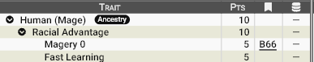
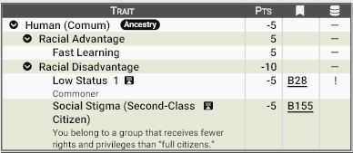

# Humanos

Poucas raças possuem uma mente tão inquieta quanto a dos humanos. Onde outros povos levam décadas para aperfeiçoar um ofício ou séculos para desenvolver uma nova tradição, os humanos aprendem observando, experimentando e, acima de tudo, errando. Sua curiosidade natural e capacidade de adaptação permitem que absorvam conhecimentos com uma velocidade surpreendente, transformando rapidamente teoria em prática.

Essa aptidão explica por que a humanidade conseguiu, em tão pouco tempo, dominar incontáveis ofícios, desenvolver novas tecnologias, criar escolas de magia e adaptar técnicas originalmente pertencentes a outras culturas. Embora raramente igualem a experiência acumulada por um elfo centenário ou a maestria artesanal de um anão veterano, os humanos frequentemente alcançam um nível impressionante de 
competência em apenas alguns anos de dedicação.

!!! info "Vantagem: Aprendizado acelerado ou Fast Learning (5 pontos)"
    
    Humanos aprendem mais rápido que as demais raças.
    **Efeito**: reduza em 1/3 o tempo de estudo ou treinamento necessário para aprender novas habilidades, técnicas e magias.

___________________________
Humanos são divididos em **magos** e **não magos (comuns)**: 

## Magos

Em Zandia, a magia não é apenas um dom — é o alicerce da cidadania. Todo indivíduo capaz de manipular mana é reconhecido como **Mago**, independentemente de seu poder, riqueza ou profissão. Um mago pode ser um rei, um soldado, um artesão, um agricultor ou um simples balconista; o que o distingue não é sua posição social, mas o fato de pertencer à classe de cidadãos plenos.

Os magos possuem direitos garantidos por lei: podem votar, ocupar cargos públicos, ingressar em universidades e academias, adquirir propriedades sem restrições, servir na administração do Estado e ascender socialmente por mérito ou talento. A sociedade foi construída para eles, e todas as suas instituições partem do pressuposto de que a magia é a marca natural de um cidadão.

Isso não significa que todos vivam em conforto. Muitos magos levam vidas modestas, trabalhando em ofícios comuns para sustentar suas famílias. Ainda assim, desfrutam de oportunidades e proteções que jamais seriam concedidas aos Comuns. Em Zandia, a diferença entre um mago pobre e um Comum rico não está na fortuna, mas nos direitos: um pertence plenamente à sociedade; o outro apenas existe à sua margem.

Curiosamente, a magia parece desafiar as linhagens familiares. Embora alguns estudiosos defendam que ela possua um componente hereditário, incontáveis magos nascem todos os anos em famílias de Comuns, enquanto casais de magos frequentemente geram filhos incapazes de manipular mana. Não existe consenso sobre a origem desse fenômeno, alimentando inúmeras teorias religiosas, filosóficas e arcanas.

Quando uma criança manifesta aptidão mágica, ela é reconhecida pelas autoridades e entregue aos cuidados de academias, ordens arcanas ou famílias de tutela, onde receberá a educação necessária para exercer seu papel como cidadã. Na maioria das vezes, isso significa crescer longe de seus pais e irmãos, mantendo apenas contatos ocasionais — quando mantêm algum.

Para muitas famílias de Comuns, esse momento é agridoce. A separação é dolorosa, mas também representa a única oportunidade de romper o ciclo de exclusão social. Ver um filho tornar-se mago significa saber que ele jamais conhecerá a vida de privações reservada aos Comuns, ainda que o preço seja abrir mão de criá-lo.

### **Modelo Racial**: Humano Mago

**Pontuação total**: 10 pontos

**Vantagens raciais:**

- Magery 0
- Fast Learning

#### **Print do GCS:**

________________________________________

Para baixar o arquivo de template do GCS <a href="/assets/templates/Human (Mage).gct" download> 📥 Clique Aqui </a>
_______________________________________

## Não Magos (Comuns)

Em Zandia, nascer sem o dom da magia significa carregar um estigma por toda a vida. Conhecidos simplesmente como **Comuns**, os não magos são considerados cidadãos de segunda categoria, vistos pela elite arcana como indivíduos inferiores, destinados a ocupar os trabalhos mais árduos e menos valorizados da sociedade.

Privados de diversos direitos fundamentais, os Comuns raramente podem ocupar cargos de poder, ingressar nas grandes academias ou influenciar os rumos políticos de suas nações. Em muitas cidades, são obrigados a viver em bairros segregados ou guetos, sujeitos a leis mais severas, impostos abusivos e à constante discriminação daqueles que detêm o poder mágico.

Embora sejam responsáveis por cultivar os campos, construir cidades, manter o comércio e servir nos exércitos, sua importância é frequentemente ignorada. Ainda assim, é entre os Comuns que surgem muitos dos maiores heróis, revolucionários e líderes populares da história de Zandia, homens e mulheres que desafiam um mundo onde o valor de uma pessoa é medido pela magia que possui — ou pela ausência dela.

### **Modelo Racial**: Humano Comum

**Pontuação total**: -5 pontos

**Vantagens raciais:**

- Fast Learning

**Vantagens raciais:**

- Low Status: Commoner -1
- Social Stigma (Second-Class Citizen)

#### **Print do GCS:**

________________________________________

Para baixar o arquivo de template do GCS <a href="/assets/templates/Human (Comum).gct" download> 📥 Clique Aqui </a>
_______________________________________

Para mais detalhes consulte também **[Magos e Magia](../magia/magia_magos.md)**.

