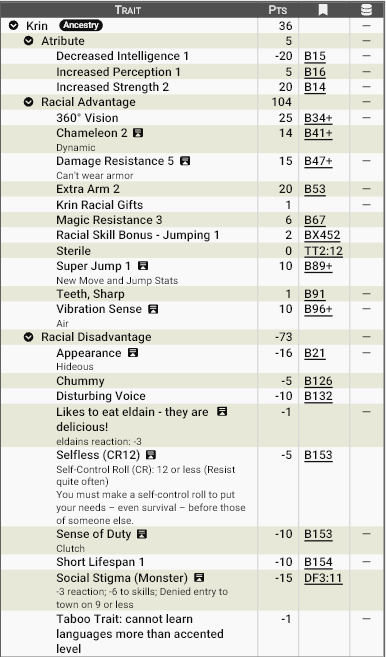

# **Krin — Os Filhos da Colmeia **

Entre as areias implacáveis de Zandia existe uma raça tão alienígena quanto fascinante: os **Krin**. Para muitos povos civilizados, são criaturas inquietantes vindas das profundezas do deserto — rápidas, silenciosas e coletivas. Para eles próprios, porém, são apenas mais um braço da grande Colmeia, instrumentos vivos de sobrevivência em um mundo hostil.

Os Krin não enxergam o mundo como indivíduos. Eles existem como partes de um todo maior.

## **Aparência**

Os Krin são humanoides insetoides altos e esguios, com cerca de 1,90 m a 2,10 m de altura quando eretos. Seu corpo é protegido por um exoesqueleto de quitina segmentada, naturalmente resistente, que funciona como uma armadura viva.

Características marcantes:

- Quatro braços longos e articulados, capazes de manipular armas e ferramentas com precisão assustadora. 
- Cabeça triangular com múltiplos olhos grandes e facetados, que refletem a luz do deserto. 
- Mandíbulas quitinosas, capazes de triturar carne, plantas e ossos. 
- Pernas poderosas, adaptadas para impulsos explosivos. 
- Capacidade de alterar a coloração da carapaça, imitando o ambiente como um camaleão. 

Suas vozes são formadas por estalidos e vibrações, produzindo uma fala estranha e desconfortável para outras raças. Por esse motivo não conseguem aprender línguas de outras raças em um nível maior que com Sotaque (Accented).

## **Fisiologia**

Os Krin são biologicamente muito diferentes dos humanoides:

- Exoesqueleto natural resistente (RD 6, não podem usar armaduras). 
- Saltos de até quatro vezes a distância humana. Todos recebem um bônus de +2 na perícia Salto.
- Camaleão (+4 em furtividade e camuflagem, limitado a visão)
- São estéreis — apenas a Rainha da colmeia põe ovos. 

Krins tem o crescimento extremamente acelerado: 
- Maturidade: ~9 anos 
- Envelhecimento precoce: ~25 anos 
- Expectativa máxima: ~50 anos 

São onivoros, mas com uma peculiar preferência cultural: **Elfos (Eldain) são considerados uma iguaria rara*. 

A variabilidade genética é grande. Alguns Krin podem desenvolver asas vestigiais ou funcionais, ferrões venenosos, membros extras, comunicação por feromônios, dentre outras características especiais. Essas variações são vistas como “especializações da colmeia”.

## **Psicologia**

A mente Krin é profundamente coletiva. eles possuem um forte altruísmo e senso do dever com o seu “ninho”. Um krin tem pPouco apego ao ego individual  e um instinto natural de cooperação. Eles possuemm uma grande facilidade em aceitar sacrifícios pessoais pelo grupo.

Para outras raças, os Krin parecem frios, literais e até diretos demais. Permanecem estranhamente calmos, mesmo diante da morte. A individualidade deles existe — mas é fraca.

Um Krin sozinho sente-se incompleto, como uma mão separada do corpo.  Definitivamente não são seres solitários, preferindo viver próximos dos outros, mesmo entre outras raças.

## **Ecologia**

Os Krin prosperam nas regiões mais hostis de Zandia, onde poucos conseguem sobreviver. Suas colmeias são Escavadas em rochas e mesas do deserto, profundas, frescas e extremamente organizadas. São ecossistemas fechados altamente eficientes.

Eles são caçadores, exploradores e sobreviventes perfeitos para sobreviver em planícies áridas, em escarpas rochosas e  em desertos pedregosos. Poucos são seus predadores naturais. 

## **Relações com Outras Raças**

As relações variam entre respeito cauteloso e medo aberto. Todos se sentem desconfortaveis com sua mentalidade coletiva. Humanos os consideram úteis, mas imprevisíveis, trocando serviços por recursos.  Anões cultivam uma respeito mútuo pela disciplina e trabalho e eventualmente estabelecem relações comerciais. Por outro lado, por questões óbvias, Elfos (Eldain) têm um relação extremamente tensa. Afinal, os Krin os veem como presa rara. Os elfos os veem como monstros. 

## **Papel em Zandia**

Em Zandia, os Krin são Habitantes naturais das terras mais severas. Assim eles ocupam um papel único como exploradores de regiões inabitáveis ou mercenários disciplinados. Alguns se tornam caçadores implacáveis, outros guardiões de rotas perigosas.

## **Por que os krin se tornam aventureiros?**

Alguns poucos deixam a colmeia para viver entre outras raças — não por rebeldia, mas porque a Colmeia decidiu que isso era necessário. Quando um Krin viaja sozinho, raramente está sozinho de verdade. Ele carrega consigo a vontade de milhares.

### **Os Caminhos da Colmeia**

A maioria dos Krin passa toda a sua vida servindo à colmeia que o gerou. Trabalham, caçam, constroem e lutam como partes de um organismo maior, encontrando propósito na prosperidade coletiva. Para eles, abandonar o ninho não é um desejo, mas uma necessidade.

Quando um Krin deixa as galerias profundas de sua colmeia para caminhar entre estrangeiros, raramente o faz por ambição pessoal. Em quase todos os casos, trata-se de uma missão considerada importante para a sobrevivência ou o crescimento da comunidade. Alguns são enviados para explorar terras desconhecidas, outros para negociar com povos distantes, proteger rotas comerciais ou recuperar recursos valiosos. Há também aqueles que carregam responsabilidades mais incomuns, como investigar ameaças misteriosas, fundar novas colmeias ou adquirir conhecimentos que beneficiarão gerações futuras.

Embora os povos civilizados frequentemente vejam esses viajantes como indivíduos independentes, a verdade é diferente. Cada Krin aventureiro representa os interesses de centenas ou milhares de irmãos. Suas vitórias pertencem à colmeia. Seus fracassos também.

A seguir estão algumas das razões mais comuns pelas quais um Krin pode tornar-se um aventureiro em Zandia:

- Explorador da Colmeia
- Coletor de Recursos
- Emissário ou Diplomata
- Mercenário da Colmeia
- Especialização da Colmeia
- Busca por uma Nova Colmeia
- Vigia Contra uma Ameaça
- Krin de Individualidade Incomum
- Peregrino da Memória da Colmeia
- Sobrevivente de uma Colmeia Destruída
- Guardião de uma Missão Sagrada da Rainha
- Observador das Outras Raças
- Caçador de Grandes Presas
- Portador de um Conhecimento Proibido
- Fundador de uma Nova Linhagem da Colmeia

Cada uma dessas motivações pode servir como base para um personagem aventureiro, mantendo a natureza coletiva dos Krin ao mesmo tempo em que explica sua presença longe do ninho. Afinal, mesmo quando caminha sozinho pelas areias de Zandia, um Krin nunca viaja apenas por si mesmo. Ele carrega consigo a vontade da Colmeia.

## <u>**Estatística**</u>

### **Modelo Racial**: Krin

**Pontuação total**: 39 pontos

**Modificadores de atributos**: ST+2, IQ-1, Per+1 

**Vantagens raciais:**

- 360º Vision
- Chameleon +2 (Dynamic)
- Damage Resistance (Cant wear armor)+6
- Extra Arm+2
- Magic Resistance+3
- Super Jump+1
- Teeth, Sharp
- Vibration Sense (Air)

**Qualidades (Perks) raciais:**

- Krin Racial Gifts
- Sterile

!!! info "Dons raciais"
    
    O Krin pode adquirir na criação do personagem ou na evolução vantagens adicionais como Vôo com asas vestigiais, membros extras, golpeadores (chifres, caudas, ferrões venenosos, etc), comunicação por feromônios, etc.

**Desvantagens raciais:**

- Appearance: Hideous
- Chummy
- Disturbing Voice
- Selfless (CR12)
- Sense of Duty: Clutch
- Short Lifespan +1
- Social Stigma: Monster

**Pecurialidades (Quirks) raciais:**

- Taboo Trait: Cannot learn languages more than accented level
- Likes to eat eldain – they are delicious!

**Bônus racial em Perícia:**

- Jumping+1

#### **Print do GCS:**

________________________________________

Para baixar o arquivo de template do GCS <a href="/assets/gdf/krin.gdf" download> 📥 Clique Aqui </a>