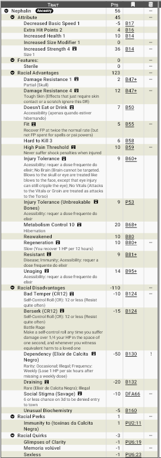

# Nephalin, os guerreiros em extinção

Os **Nephalin** são uma raça artificial criada por meio de uma forma extremamente avançada de alquimia milhares de anos antes do Cataclismo, quando Zandia ainda era um mundo fértil. Eles foram desenvolvidos como armas de guerra, criaturas humanoides capazes de sobreviver a ferimentos que normalmente seriam fatais para qualquer outra raça.

Pouco se sabe sobre os alquimistas responsáveis por sua criação. Eles pertenciam a uma civilização anterior ao Cataclismo, e quase todos os registros relacionados à criação dos Nephalin foram destruídos, perdidos ou encontram-se escondidos em ruínas antigas. Não se sabe se os Nephalin foram criados por um único povo ou se diferentes civilizações participaram de seu desenvolvimento.

O objetivo de seus criadores, entretanto, é evidente em sua fisiologia. Os Nephalin possuem uma pele extremamente resistente, ossos virtualmente inquebráveis e uma estrutura óssea particularmente desenvolvida para proteger o crânio e os órgãos vitais. Foram concebidos para continuar lutando mesmo depois de sofrerem ferimentos que incapacitaram ou matariam outros soldados.

Os Nephalin, porém, possuem duas características que se tornaram fundamentais para seu destino. A primeira é a **esterilidade**: eles não conseguem gerar descendentes, nem mesmo possuem órgãos reprodutores. A segunda é sua dependência de um **elixir alquímico**, necessário para preservar as propriedades extraordinárias de seus corpos.

O elixir contém **Calcita Negra** - um elemento altamente tóxico para a maioria das raças - além de outros componentes minerais e alquímicos. Sem doses regulares, os Nephalin começam lentamente a perder sua resistência física, podendo eventualmente morrer. A produção independente do elixir é considerada ilegal em Zandia.

Essa proibição não é uma simples coincidência nem apenas uma medida de segurança alquímica. Ao longo dos séculos, o controle da produção e distribuição do elixir tornou-se uma importante ferramenta política. Os **[Arquitetos](../mundo/arquitetos.md)**, os doze arquimagos que governam Zandia, e outras organizações poderosas (tais como o **[Sindicato](../faccoes/sindicato.md)**) controlam grande parte do acesso legítimo à substância.

Isso permite uma forma particularmente eficiente de controle: **os Nephalin são fisicamente extremamente difíceis de dominar, mas dependem de algo que outras pessoas podem controlar**.

Alguns Nephalin aceitam essa estrutura e servem aos Arquitetos ou a outras instituições em troca de proteção e acesso ao elixir. Outros vivem escondidos e dependem do mercado clandestino para sobreviver. Existem também aqueles que procuram uma maneira de romper completamente essa dependência.

Milhares de anos de guerras, catástrofes e perseguições fizeram sua população diminuir continuamente. Como não podem gerar descendentes, cada Nephalin perdido representa uma perda permanente para a raça.

Atualmente, os Nephalin estão **em extinção**.

---

## Aparência

Os Nephalin possuem aparência humanoide, mas sua constituição física os diferencia imediatamente da maioria das raças de Zandia. São mais altos (2,10 a 2,70m) e robustos, com musculatura densa e uma estrutura corporal compacta. Seu peso costuma ser significativamente maior do que sua aparência indicaria devido à elevada densidade de seus ossos.

Sua pele é espessa, áspera e rígida, apresentando uma textura semelhante a couro endurecido ou pedra desgastada pelo vento. Embora continue sendo flexível e permita movimentos normais, possui uma resistência muito superior à pele de outras raças.

A coloração da pele varia entre tons de cinza, cinza-azulado, marrom, bronze, ocre e vermelho-terroso. Indivíduos que passaram muitos anos expostos ao ambiente de Zandia frequentemente apresentam manchas, cicatrizes e padrões semelhantes a veios de pedra. Nephalin muito antigos podem adquirir uma aparência particularmente desgastada, com linhas e fissuras superficiais na pele.

A característica mais marcante da raça são as **cristas ósseas presentes na testa**. Elas não são chifres, mas extensões do próprio crânio e fazem parte integral de seu esqueleto.

As cristas começam a surgir durante o desenvolvimento e crescem lentamente até a idade adulta. Sua forma varia bastante entre indivíduos. Algumas são largas e curtas, enquanto outras se projetam para cima ou para trás, acompanhando o formato da cabeça.

Além da função defensiva, as cristas possuem importância cultural. Diferentes linhagens podem apresentar padrões característicos, e os Nephalin frequentemente as decoram com metais, pigmentos, couro ou pequenas joias. A destruição ou mutilação deliberada da crista de outro Nephalin é considerada uma grave forma de violência e humilhação.

---

## Fisiologia

A fisiologia dos Nephalin é o resultado de uma antiga forma de engenharia alquímica. Seus criadores desenvolveram um organismo capaz de manter características físicas extraordinárias por meio de alterações biológicas e processos alquímicos que atualmente são pouco compreendidos.

### Pele Pétrea

A pele Nephalin possui uma camada externa extremamente resistente. Sua estrutura reduz consideravelmente os efeitos de cortes, abrasões e impactos superficiais, funcionando como uma espécie de armadura natural.

Apesar disso, a pele não é uma carapaça. Continua sendo tecido vivo e flexível, permitindo movimentos normais. Armas suficientemente poderosas ainda podem penetrá-la, mas ataques que seriam capazes de ferir gravemente a pele de um humano frequentemente produzem apenas ferimentos superficiais nos Nephalin.

### Ossos Inquebráveis

A característica mais extraordinária dos Nephalin é seu esqueleto.

Seus ossos possuem uma estrutura mineral-alquímica extremamente resistente, tornando-os virtualmente impossíveis de quebrar por meios convencionais. A característica está presente em todo o esqueleto, mas é particularmente importante no crânio, coluna vertebral, caixa torácica e pelve.

O crânio é ainda mais protegido pelas cristas ósseas, que reforçam sua estrutura. A combinação entre o próprio osso, as cristas e a resistência da pele torna a cabeça dos Nephalin uma das regiões mais protegidas de seu corpo.

A caixa torácica oferece proteção semelhante ao coração e aos pulmões. Como as costelas não podem ser facilmente quebradas, ataques que normalmente atingiriam diretamente os órgãos vitais encontram uma barreira praticamente impossível de atravessar.

Isso não torna os Nephalin invulneráveis. Seus músculos, vasos sanguíneos, nervos e órgãos continuam sendo tecidos vivos e podem sofrer danos. Um ataque suficientemente poderoso ainda pode provocar concussões, hemorragias ou lesões internas.

A diferença é que **os caminhos convencionais para atingir diretamente cérebro e órgãos vitais estão protegidos por uma estrutura que praticamente não pode ser quebrada**.

### Regeneração

Os Nephalin também possuem uma capacidade extraordinária de recuperação de ferimentos. Seu metabolismo consegue reparar tecidos danificados muito mais rapidamente que o de outras raças.

A regeneração não substitui sua resistência física, mas complementa sua fisiologia. Mesmo quando um golpe consegue atravessar a pele e atingir músculos ou outros tecidos, o organismo Nephalin é capaz de recuperar-se rapidamente.

Essa capacidade, entretanto, também depende da manutenção adequada de seu metabolismo alquímico.

---

### Donos de uma bioquímica incomum

Como são seres criados por meio de processos alquímicos e dependentes de uma substância exótica, a sua própria natureza bioquímica é diferente. Por isso elixires, poções e outras drogas que funcionariam normalmente em outras raças nem sempre funcionam da maneira esperada neles, podendo não funcionar ou até mesmo causar efeitos colaterais! Há relatos de elixires especialmente preparados por nephalins mas são caros e extremamente caros!

### O Elixir Alquímico

A fisiologia dos Nephalin depende de uma substância que se tornou tão importante quanto sua própria alimentação: o **Elixir de Calcita Negra**, conhecido simplesmente como elixir entre os Nephalin.

O elixir contém Calcita Negra, além de outros minerais e componentes alquímicos. A Calcita Negra não pode ser simplesmente consumida. Ela precisa passar por um processo específico que transforma seus componentes em uma forma que o organismo Nephalin consegue absorver.

O elixir fornece as substâncias necessárias para preservar a estrutura mineral dos ossos, a resistência da pele, a integridade das cristas e a capacidade de recuperação dos tecidos.

A frequência das doses varia de indivíduo para indivíduo, mas nenhum Nephalin pode permanecer indefinidamente sem o tratamento.

### Deficiência

Os primeiros sinais da falta do elixir são relativamente sutis. O Nephalin começa a apresentar fadiga, dores musculares, rigidez e recuperação mais lenta após ferimentos.

Com a deficiência prolongada surgem dores ósseas, enfraquecimento das cristas, perda progressiva da resistência da pele e redução da capacidade de regeneração.

Em estágios avançados, o próprio esqueleto começa a perder suas propriedades extraordinárias. Um Nephalin que chega a esse ponto pode tornar-se fisicamente semelhante a qualquer outro humanoide e, eventualmente, morrer devido à falência de seu organismo.

Para os Nephalin, portanto, o elixir não é um luxo, uma droga ou um suplemento. **É um medicamento essencial à sobrevivência.**

---

### O Controle do Elixir

A produção e distribuição do elixir são rigidamente controladas em Zandia.

Oficialmente, a proibição da produção independente é justificada pelos perigos envolvidos na alquimia da Calcita Negra e pelo risco de que conhecimentos antigos relacionados à criação dos Nephalin possam ser redescobertos.

Esses argumentos possuem alguma verdade. A produção do elixir exige conhecimentos alquímicos extremamente avançados e certos processos podem ser perigosos.

Entretanto, a proibição também possui uma função política muito mais importante.

**Controlar o elixir significa controlar os Nephalin.**

Os Arquitetos e outras organizações poderosas possuem acesso autorizado à produção e distribuição da substância. Nephalin que trabalham para essas instituições geralmente recebem o elixir regularmente como parte de sua proteção ou remuneração.

Um Nephalin que abandona esse sistema encontra uma situação muito diferente.

Sem autorização para adquirir o elixir, ele precisa recorrer a alquimistas clandestinos, contrabandistas e mercados ilegais. O preço é elevado e a qualidade do produto é incerta. Elixires adulterados ou mal preparados podem ser ineficazes ou até perigosos.

Isso criou uma dependência política extremamente eficiente. Um Nephalin pode possuir força suficiente para enfrentar vários guerreiros, mas ainda depender de uma pequena quantidade de líquido fornecida por outra pessoa para permanecer saudável.

A resistência física dos Nephalin não garante sua liberdade.

### Os Arquitetos

Os doze **Arquitetos**, os arquimagos que governam Zandia atualmente, não criaram os Nephalin e não são responsáveis por sua origem.

Entretanto, ao longo da história recente, eles passaram a exercer grande influência sobre a raça por meio do controle político do elixir.

Nem todos os Arquitetos necessariamente possuem a mesma opinião sobre os Nephalin. Alguns podem considerar o controle necessário para impedir que os Nephalin sejam novamente utilizados como exércitos. Outros podem enxergá-los como uma população que precisa ser protegida. Há também aqueles que utilizam deliberadamente o acesso ao elixir para garantir a lealdade dos Nephalin.

Essa diferença de opiniões permite que a questão Nephalin seja também uma questão política dentro do próprio governo dos Arquitetos.

---

### Esterilidade e Extinção

Nephalins não envelhecem e são imunes a doenças. Contudo, são biologicamente estéreis e não conseguem gerar descendentes. Acredita-se que essa característica tenha sido deliberadamente incorporada ao seu projeto original. Como armas de guerra, os Nephalin deveriam ser produzidos sob controle de seus criadores, e não formar uma população independente capaz de se reproduzir.

Durante milhares de anos, essa limitação tornou-se cada vez mais significativa. Guerras, doenças, acidentes, perseguições e o próprio Cataclismo reduziram continuamente sua população. Como não existe uma nova geração capaz de substituir os mortos, cada perda é permanente. 

Os Nephalin encontram-se atualmente em extinção. Não existem crianças Nephalin nascidas naturalmente. Os poucos indivíduos existentes são sobreviventes de comunidades antigas ou indivíduos criados em processos artificiais de uma época muito anterior. Essa realidade influencia profundamente sua cultura. Memórias, objetos e conhecimentos possuem enorme valor, pois os Nephalin sabem que algumas tradições podem desaparecer simplesmente porque não haverá ninguém para transmiti-las.

---

## Psicologia

Os Nephalin possuem personalidades tão diversas quanto qualquer outra raça, e sua origem artificial não os impede de desenvolver emoções, vínculos, ambições e crenças próprias. Entretanto, sua história como uma raça criada para a guerra e sua atual condição de espécie em extinção deixaram marcas profundas em sua psicologia e em sua cultura.

Eles tendem a valorizar resistência, disciplina, competência, lealdade e autocontrole. A capacidade de suportar dor e continuar funcionando sob pressão é considerada uma virtude importante, especialmente entre comunidades que preservaram tradições militares de sua antiga existência.

Entretanto, existe uma diferença fundamental entre a maneira como os Nephalin encaram a morte e a maneira como outras raças podem encará-la.

Para a maioria dos povos, a morte de um indivíduo representa uma perda pessoal, familiar ou comunitária. Entre os Nephalin, ela representa também uma **perda irreparável para toda a espécie**. Um humano que morre pode deixar filhos que continuarão sua linhagem. Uma família é capaz de crescer novamente ao longo das gerações. Entre os Nephalin, isso não existe.

Um Nephalin morto não será substituído.

Não haverá uma criança para ocupar seu lugar, nem uma nova geração para preservar aquilo que ele sabia. Cada indivíduo representa uma parcela da população que não pode ser recuperada.

Por isso, a sobrevivência individual adquiriu uma importância cultural muito maior entre os Nephalin. Não se trata simplesmente de medo da morte. Um Nephalin pode ser extremamente corajoso e aceitar riscos que outras raças considerariam absurdos. O que muda é a consciência de que sua vida possui um valor que ultrapassa sua própria existência.

### O Peso da Morte

A morte de um Nephalin costuma provocar sentimentos complexos. Existe o luto pela perda do indivíduo, mas também a consciência de que a própria raça ficou menor. Essa percepção pode produzir comportamentos que parecem contraditórios para outras culturas. Um Nephalin pode ser capaz de enfrentar sozinho um inimigo extremamente perigoso, mas considerar irresponsável colocar sua vida em risco sem uma razão realmente importante.

Atos de sacrifício podem ser particularmente controversos. Em determinadas circunstâncias, um Nephalin pode decidir conscientemente sacrificar sua vida para salvar seus companheiros. Entretanto, outros Nephalin podem considerar esse ato uma tragédia evitável. Salvar cinco indivíduos sacrificando um sexto pode ser racional em uma situação extrema, mas não deixa de significar que a raça perdeu permanentemente um de seus poucos membros.

Essa questão pode gerar debates profundos entre os próprios Nephalin. Alguns acreditam que uma vida deve ser sacrificada quando isso garante a sobrevivência de muitos outros. Outros consideram que cada indivíduo possui um valor tão grande que sua morte só pode ser aceita quando absolutamente inevitável. 

Não existe uma resposta universal. Essa tensão é especialmente importante para Nephalin aventureiros, pois a própria natureza de suas atividades frequentemente exige assumir riscos.

### A Fúria da Pedra

Essa realidade torna a **Fúria da Pedra** uma das maiores contradições da cultura Nephalin.

Os Nephalin foram originalmente criados como soldados. Seus corpos foram projetados para suportar ferimentos e continuar lutando, e sua psicologia pode favorecer respostas agressivas diante de ameaças. Em situações extremas, alguns indivíduos entram em um estado de fúria no qual o instinto de combate supera temporariamente o julgamento racional.

Para um indivíduo de outra raça, entrar em uma fúria pode ser visto como uma característica perigosa, mas compreensível de um guerreiro. Para os Nephalin, o problema é muito maior.

Um Nephalin tomado pela Fúria da Pedra pode ignorar ferimentos, avançar contra inimigos muito superiores e continuar lutando mesmo quando uma retirada seria a escolha racional. Sua própria fisiologia torna esse comportamento ainda mais perigoso, pois a resistência extraordinária de seu corpo pode fazer com que ele demore muito mais para perceber o quanto sua situação se tornou perigosa.

Assim, a Fúria da Pedra representa uma contradição fundamental: **a mesma característica que fez dos Nephalin excelentes armas de guerra pode contribuir para a destruição de uma raça que já não pode substituir seus mortos.** 

Por isso, o autocontrole possui um valor especial entre eles. Um Nephalin que aprende a controlar sua fúria não está apenas protegendo a si mesmo. Está preservando um dos poucos indivíduos que ainda existem.

### A Culpa do Sobrevivente

A condição dos Nephalin também pode produzir um sentimento conhecido entre eles como **Culpa do Sobrevivente**. Quando um grupo perde um Nephalin, aqueles que permanecem podem questionar se a morte poderia ter sido evitada. Essa sensação é especialmente forte quando o indivíduo morreu por uma decisão considerada imprudente ou desnecessariamente heroica.

Um Nephalin pode carregar durante décadas a lembrança de um companheiro que morreu para salvá-lo. A pergunta não é apenas "por que ele morreu?", mas também:

**"Por que ele morreu e eu continuei vivo?"**

Em uma raça numerosa, esse tipo de sentimento pode diminuir ao longo das gerações. Entre os Nephalin, ele pode permanecer durante muito tempo, especialmente entre indivíduos que vivem por séculos ou que preservam memórias detalhadas de seus mortos.

Isso também faz com que os Nephalin tenham uma relação muito forte com nomes e memória. Alguns mantêm registros dos mortos, preservam seus objetos pessoais ou contam suas histórias para que a existência daquele indivíduo não desapareça completamente.

### O Valor de uma Vida

A consequência mais profunda de sua esterilidade é que os Nephalin desenvolveram uma noção de **continuidade coletiva** muito mais forte do que a maioria das raças. Um Nephalin não é apenas um indivíduo. Ele também é um dos poucos sobreviventes de uma linhagem que não pode mais crescer naturalmente.

Isso não significa que todos os Nephalin sejam altruístas ou que coloquem a raça acima de si mesmos. Existem egoístas, criminosos, covardes e indivíduos que simplesmente não se importam com o destino de seu povo. Mas mesmo aqueles que rejeitam qualquer responsabilidade coletiva sabem, em algum nível, que sua morte é permanente.

Essa consciência pode produzir tanto coragem quanto cautela. Alguns Nephalin se tornam extremamente protetores de seus companheiros. Outros desenvolvem uma necessidade quase obsessiva de preservar a própria vida. Alguns evitam riscos completamente, enquanto outros acreditam que, justamente porque possuem poucas vidas disponíveis, cada uma delas deve ser utilizada para garantir a sobrevivência das demais.

Essa diferença de visão pode criar conflitos dentro da própria raça. Para alguns, **viver é uma responsabilidade**. Para outros, **viver sem liberdade não é realmente viver**. E para os Nephalin que ainda carregam os instintos de seus antigos criadores, existe uma terceira possibilidade: simplesmente ignorar tudo isso e lutar.

É justamente dessa contradição que nasce uma das maiores dificuldades da cultura Nephalin: eles foram criados para não temer a morte, mas sobreviveram tempo suficiente para descobrir que **a morte de cada um deles importa mais do que jamais deveria ter importado para uma arma de guerra**.

---

### Memória e Continuidade

A longevidade dos Nephalin não significa que cada indivíduo acumule milhares de anos de conhecimento. Sua fisiologia alquímica possui uma característica conhecida como **Memória Volúvel**: conhecimentos e lembranças que deixam de ser utilizados por longos períodos podem desaparecer gradualmente. Habilidades praticadas com frequência e experiências emocionalmente marcantes tendem a permanecer, enquanto outras podem se transformar em fragmentos ou simples sensações de familiaridade. Assim, um Nephalin pode ter milhares de anos de existência e ainda possuir apenas uma parcela de suas antigas experiências acessível à sua mente.

Os Nephalin também são capazes de entrar em **Períodos de Dormência**, reduzindo drasticamente seu metabolismo e permanecendo inconscientes durante anos ou até décadas. Essa capacidade provavelmente fazia parte de seu projeto original como armas de guerra, permitindo que fossem preservados e despertados quando necessários. A dormência, porém, acelera a erosão das memórias, e alguns dos Nephalin mais antigos despertaram após séculos em um mundo completamente diferente daquele que conheciam. Alguns podem ter atravessado o próprio Cataclismo dessa maneira.

Por causa disso, a existência de um Nephalin é frequentemente dividida em diferentes **Vidas**. Um indivíduo pode ter sido soldado durante séculos, depois ferreiro, mercador ou explorador, antes de entrar em dormência e despertar para iniciar uma nova fase de sua existência. Essas Vidas não são identidades completamente diferentes, mas períodos distintos de uma mesma existência, separados por mudanças profundas de interesses, relações e conhecimentos. Para um Nephalin, começar uma nova Vida pode significar abandonar uma antiga profissão, reconstruir sua identidade ou simplesmente descobrir quem deseja ser agora.

A perda gradual de memória também tornou a preservação do conhecimento uma questão de sobrevivência para a raça. Por isso existem os **Guardiões Mnemônicos**, responsáveis por registrar nomes, acontecimentos, técnicas, tradições, histórias e as diferentes Vidas dos Nephalin. Seus arquivos funcionam como uma extensão da memória coletiva da raça, preservando aquilo que inevitavelmente pode desaparecer das mentes individuais.

> **Para um Nephalin, sobreviver não significa apenas manter o corpo vivo. Significa também impedir que aquilo que ele foi desapareça completamente.**

Para uma descrição detalhada da **Memória Volúvel**, dos **Períodos de Dormência**, das **Vidas** e dos **Guardiões Mnemônicos**, consulte o artigo [**Memória e Continuidade dos Nephalin**](../racas/nephalin_memoria.md).

---

## Ecologia

Os Nephalin são onívoros e podem consumir praticamente os mesmos alimentos que outras raças humanoides. Carne, peixes, grãos, frutas, raízes e vegetais fazem parte de sua alimentação normal.

Sua principal peculiaridade ecológica é a dependência do elixir. Alimentos comuns fornecem a energia necessária para seu metabolismo, mas não substituem as substâncias alquímicas necessárias para manter sua estrutura corporal.

Essa dependência influencia diretamente onde comunidades Nephalin conseguem viver. Algumas se estabelecem próximas a regiões onde existe Calcita Negra. Outras dependem de alquimistas capazes de preparar o elixir. Comunidades clandestinas frequentemente mantêm pequenos laboratórios secretos ou desenvolvem relações com comerciantes e mineradores.

### Uma raça de outro mundo

Os Nephalin não foram criados para viver no deserto. Quando foram desenvolvidos, Zandia ainda possuía um clima e ecossistemas completamente diferentes. Sua resistência ao calor, à areia e aos ambientes hostis é consequência de sua fisiologia robusta, não de uma adaptação específica ao deserto.

Isso torna os Nephalin uma espécie de testemunho vivo do mundo anterior ao Cataclismo. Seu corpo foi projetado para sobreviver às guerras de uma era antiga, mas acabou sobrevivendo também à civilização que os criou e ao próprio mundo que existia naquela época.

---

## Relações com Outras Raças

A maioria das raças modernas conhece os Nephalin principalmente através de lendas. Histórias antigas os descrevem como soldados impossíveis de matar, monstros artificiais ou guerreiros de civilizações desaparecidas. Poucos compreendem que eles ainda existem e que sua população está diminuindo.

### Humanos

Os humanos costumam enxergar os Nephalin com uma mistura de respeito, medo e interesse. Sua força e resistência fazem com que sejam procurados como mercenários, guarda-costas, soldados, exploradores e trabalhadores capazes de suportar condições extremas.
 
Entretanto, sua aparência incomum também pode provocar preconceito. Nephalin que vivem entre humanos frequentemente escondem sua verdadeira natureza e, principalmente, sua dependência do elixir.

Essa dependência pode ser utilizada para explorá-los. Um empregador, organização criminosa ou autoridade que controle o acesso ao elixir possui uma poderosa forma de pressionar um Nephalin.

### Anões

Os anões possuem uma relação particularmente importante com os Nephalin devido ao seu conhecimento de mineração e alquimia.

A Calcita Negra é um recurso de grande interesse para comunidades anãs, e alguns alquimistas anões preservam conhecimentos capazes de auxiliar na preparação do elixir. Por isso, comunidades anãs podem servir como importantes pontos de apoio para Nephalin independentes.

Existe também uma afinidade cultural entre os dois povos. Os anões possuem uma profunda relação com pedra e minerais, enquanto os Nephalin carregam em seus próprios corpos uma estrutura cuja resistência depende desses mesmos elementos.

### Elfos

Os elfos possuem uma relação mais complexa com os Nephalin. Para alguns, eles representam uma lembrança viva das antigas civilizações que buscavam manipular a vida através da alquimia. Outros os consideram vítimas de uma época em que indivíduos eram criados para servir a propósitos que jamais escolheram.

Elfos interessados na história anterior ao Cataclismo podem considerar os Nephalin especialmente valiosos, pois alguns indivíduos muito antigos preservam memórias e tradições que desapareceram entre outras raças.

### Os Arquitetos

A relação com os Arquitetos é principalmente política. Os doze Arquitetos não são os criadores dos Nephalin, mas atualmente governam Zandia e possuem influência significativa sobre seu destino.

Alguns Nephalin servem diretamente aos Arquitetos como guardas, soldados, agentes, exploradores ou investigadores. Para esses indivíduos, o serviço pode proporcionar proteção, estabilidade e acesso garantido ao elixir. Outros Nephalin rejeitam completamente essa relação. Consideram que a dependência do elixir já proporciona poder demais às autoridades e que servir aos Arquitetos apenas perpetua essa situação. Há também aqueles que mantêm uma relação puramente pragmática: servem porque precisam do elixir, mas não possuem qualquer lealdade particular aos seus empregadores.

Essa divisão cria uma tensão constante dentro da própria raça entre aqueles que aceitam a proteção das estruturas de poder e aqueles que preferem arriscar a própria sobrevivência para manter sua independência.

---

## Por que os Nephalin se tornam Aventureiros?

A situação dos Nephalin faz com que a vida de aventureiro seja uma escolha muito mais natural para eles do que poderia parecer inicialmente.

A busca pelo **elixir** é uma das motivações mais comuns. Um Nephalin pode precisar encontrar Calcita Negra, recuperar ingredientes raros ou localizar um alquimista capaz de preparar uma nova dose. Uma ruína ou mina que representa apenas uma oportunidade de riqueza para outros aventureiros pode representar, para um Nephalin, meses ou anos adicionais de vida.

Outros se tornam aventureiros em busca de uma **cura para sua dependência**. As antigas ruínas das civilizações que criaram os Nephalin podem conter laboratórios, registros ou fórmulas capazes de explicar como seu organismo funciona. Talvez exista uma maneira de eliminar completamente a necessidade do elixir.

Alguns procuram uma forma de **restaurar a fertilidade da raça**. Para esses Nephalin, recuperar os conhecimentos dos antigos alquimistas pode ser a única esperança de impedir que seu povo desapareça.

Há aqueles que querem descobrir a verdade sobre seus **criadores**. Quem eram os alquimistas responsáveis? Por que criaram os Nephalin? Por que decidiram torná-los estéreis? Quantos foram produzidos? Existiam diferentes tipos ou castas de Nephalin? E por que o conhecimento necessário para criá-los desapareceu? Essas perguntas podem levar aventureiros Nephalin às ruínas mais antigas de Zandia.

Também existem Nephalin que se tornam aventureiros para **escapar do controle das autoridades**. Eles recusam o serviço aos Arquitetos ou a outras organizações poderosas e precisam encontrar maneiras alternativas de obter o elixir. Tornar-se aventureiro permite viajar, estabelecer contatos e construir uma rede própria de fornecedores e aliados.

Por outro lado, alguns aventureiros Nephalin trabalham diretamente para os Arquitetos. São enviados para explorar ruínas, recuperar artefatos, investigar ameaças ou localizar conhecimentos alquímicos perdidos. Para esses indivíduos, aventurar-se é simplesmente uma extensão de seu serviço.

Finalmente, existe uma motivação mais pessoal. Alguns Nephalin simplesmente querem experimentar uma vida que nunca foi planejada para eles. Foram criados como armas, mas sobreviveram por milhares de anos. Seus criadores desapareceram, suas guerras terminaram e o mundo mudou completamente. Agora precisam decidir por si mesmos o que fazer com suas vidas.

!!!info "O Dilema dos Nephalin"
    Os Nephalin foram criados para serem armas de guerra, mas a guerra para a qual foram criados terminou há milhares de anos. Sua civilização desapareceu. Seus criadores desapareceram. O mundo que conheciam desapareceu. A raça não pode se reproduzir e depende de um elixir ilegal para continuar existindo. Seu acesso ao medicamento é controlado por aqueles que possuem poder político e econômico em Zandia.

    Alguns Nephalin aceitam essa realidade em troca de segurança. Outros lutam contra ela. Alguns procuram uma cura, outros procuram seus criadores, e outros simplesmente querem garantir que os últimos membros de sua raça possam viver com dignidade. A grande questão dos Nephalin não é se seus corpos podem ser destruídos. É se eles conseguirão conquistar liberdade antes que sua raça desapareça.
    
    >**Eles foram criados para serem armas que ninguém conseguiria quebrar. Com o passar dos milênios, descobriram que não era necessário quebrar uma arma para controlá-la — bastava controlar aquilo de que ela precisava para continuar funcionando.**

---
## <u>**Estatística**</u>

### **Modelo Racial**: Nephalin

**Pontuação total**: 56 pontos

**Modificadores de atributos**: ST+4, HT+1, HP+2,  Basic Speed-0.25, SM-1

**Vantagens raciais:**

- Damage Resistance (skull only)+1
- Damage Resistance (Tough skin)+4
- Doesnt eat or drink (only in hibernation)
- Fit
- Hard to Kill+3
- Hipoalgia
- Injure Tolerance: Unbreakable Bones, No Brain, No Vitals (acessibility: requer o uso frequente do elixir)
- Metabolism Control (Hibernation)+10
- Reawakened
- Regeneration (Slow)
- Resistant (Imunity, Disease; acessibility: requer o uso frequente do elixir)
- Unaging (acessibility: requer o uso frequente do elixir)

**Perks Raciais:**
- Imunity to elixir Calcita Negra

**Desvantagens raciais:**

- Bad Temper(CR 12)
- Berseker (Battle Fury)(CR12)
- Dependency (Elixir de Calcita Negra, comum, ilegal, diário, perda de 1 Pv/hora
- Draining: Calcita Negra (Rare, Ilegal) 
- Social Stigma: savage
- Unusual Biochemistry

**Pecurialidades raciais:**

- Glimpses of clarity
- Memória volúvel
- Sexless

#### **Print do GCS:**

________________________________________

Para baixar o arquivo de template do GCS <a href="/assets/templates/nephalin.gct" download> 📥 Clique Aqui </a>