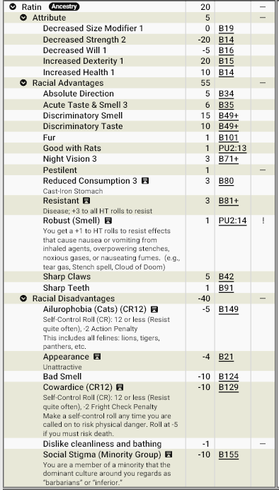

# **Ratinos - os Lixeiros de Zandia**

Nas grandes cidades-estado de Zandia, existe uma população invisível que prospera longe da luz: os Ratinos. Considerados párias por muitas raças, esses ratos humanóides transformaram os esgotos, lixões e ruínas esquecidas em seu verdadeiro lar. Onde outros veem podridão, perigo e doença, eles enxergam oportunidade, abrigo e sustento.

Embora desprezados, poucos negam sua utilidade. Eles são rastreadores excepcionais, exploradores silenciosos e sobreviventes incomparáveis. Nas caravanas que cruzam o deserto, não é raro encontrar um deles caminhando à frente da coluna, farejando perigos que nenhum humano conseguiria perceber.

## **Aparência**

Ratinos são humanoides de baixa estatura, geralmente entre 1,40 m e 1,60 m, com corpos esguios e flexíveis. Seus rostos lembram roedores: focinho alongado, incisivos aparentes e vibrissas sensíveis que captam vibrações do ar e do solo.

Sua pelagem varia do marrom escuro ao cinza amarelado, muitas vezes manchada pela poeira do deserto ou pela sujeira dos esgotos. A cauda longa e nua é extremamente expressiva e auxilia no equilíbrio em superfícies instáveis.

Seus olhos grandes e brilhantes refletem luz com facilidade, revelando sua adaptação à penumbra. Muitos usam roupas improvisadas feitas de restos de tecido, couro velho e sucata, criando uma estética irregular e funcional.

## **Fisiologia**

A fisiologia dos Ratinos é um exemplo extremo de adaptação à sobrevivência. Possuem olfato e audição extremamente desenvolvidos. Seu sistema digestivo é incrivelmente resistente, capaz de processar comida estragada, carniça e praticamente qualquer material orgânico. Eles demonstram alta resistência a doenças e toxinas comuns. Além disso, são ágeis e diminutos, capazes de atravessar espaços estreitos com facilidade. 

Essa biologia os torna ideais para ambientes contaminados e insalubres. Aquilo que mataria outras raças raramente passa de um incômodo para um Ratino.

## **Psicologia**

A mente Ratino é moldada pela sobrevivência coletiva. Eles valorizam o pragmatismo acima de honra, a ooperação acima de heroísmo e  astúcia acima de força.  

Não são naturalmente malignos, mas crescer em ambientes hostis os torna desconfiados e oportunistas. Ratinos costumam ser covardes e cautelosos, sempre avaliando rotas de fuga e possíveis ameaças. 

Possuem forte empatia com ratos comuns. Muitos criam colônias domesticadas que funcionam como sentinelas, mensageiros ou companheiros 
Para um Ratino, um rato nunca é “praga”, mas sim parente distante.

Todos os ratinos têm um medo irracional por gatos (e outros felinos), talvez um resquício da sua origem animal.

## **Ecologia**

Os Ratinos ocupam nichos ignorados por outras raças, tais como esgotos urbanos, túneis abandonados, ruínas soterradas, lixões, depósitos de sucata e fendas rochosas nas bordas das cidades. Eles vivem em colônias complexas, conectadas por túneis secretos. Essas redes subterrâneas frequentemente se estendem por quilômetros sob as cidades de Zandia.

Sua dieta inclui restos descartados por outras raças, pequenos animais e qualquer material orgânico disponível. Dessa forma, atuam involuntariamente como recicladores naturais do ecossistema urbano, os “lixeiros” das cidades.

## **Relações com Outras Raças**

A relação com outras raças é marcada por preconceito e utilidade prática. Associados à sujeira e doenças, Ratinos são considerados indignos ou repugnantes, sendo frequentemente culpados por crimes urbanos.  Apesar disso, há exceções: muitos mercadores valorizam sua habilidade como batedores e rastreadores, reconhecendo sua utilidade na detecção de perigos e rotas seguras. Criminosos e contrabandistas usam os ratinos como mensageiros e guias subterrâneos. Poucos os respeitam, mas muitos dependem deles.

## **Papel em Zandia**

Em Zandia, os Ratinos cumprem um papel essencial e paradoxal: são desprezados e indispensáveis ao mesmo tempo.

Eles são:

- Os limpadores invisíveis das cidades 
- Exploradores de ruínas enterradas 
- Guias subterrâneos 
- Batedores de caravanas no deserto 

Sem eles, os esgotos transbordariam, túneis ruiriam sem manutenção e muitas caravanas desapareceriam nas areias. Eles vivem nas sombras, mas sustentam silenciosamente a civilização. E enquanto as cidades de Zandia continuarem a produzir lixo, segredos e túneis esquecidos… sempre haverá ratinos prosperando abaixo delas.

## **Por que os ratinos se tornam aventureiros?**

### **Os Caminhos das Sombras**

A maioria dos Ratinos nasce, vive e morre nas profundezas esquecidas das cidades de Zandia. Entre túneis, esgotos, ruínas soterradas e passagens secretas, eles constroem comunidades que raramente aparecem nos mapas e quase nunca recebem reconhecimento. Para muitos deles, sobreviver já é uma conquista diária.

Ainda assim, alguns escolhem — ou são obrigados — a abandonar a relativa segurança de suas colônias e aventurar-se pelo mundo. Diferentemente de outras raças, os Ratinos raramente buscam glória, honra ou poder. Suas motivações costumam ser muito mais práticas: encontrar recursos para a colônia, escapar de perigos, descobrir novos refúgios ou simplesmente aproveitar oportunidades que surgem além dos túneis.

A vida ensinou aos Ratinos que ninguém lhes dará nada de graça. Por isso, tornam-se exploradores, batedores, guias, caçadores de tesouros e mercadores de informações. Sua capacidade de encontrar caminhos onde outros veem apenas obstáculos faz deles companheiros valiosos para caravanas, aventureiros e até mesmo organizações criminosas.

Muitos estrangeiros enxergam um Ratino aventureiro como um ladrão em potencial ou um oportunista sem escrúpulos. Embora alguns realmente se encaixem nessa descrição, a maioria está apenas tentando sobreviver da melhor forma que conhece: usando inteligência, cautela e adaptabilidade para transformar qualquer situação em uma oportunidade.

Algumas das razões mais comuns pelas quais um Ratino pode tornar-se um aventureiro em Zandia:

**Explorador de Ruínas Soterradas:** Ruínas antigas escondem tesouros, artefatos e passagens esquecidas. Poucos são melhores em encontrá-las do que um Ratino.

**Batedor de Caravanas:** Sua audição e olfato aguçados o tornam ideal para detectar emboscadas, tempestades e predadores antes que seja tarde.

**Coletor de Sucata e Relíquias:** Aquilo que outros consideram lixo pode valer uma fortuna para alguém que saiba como reutilizar ou vender.

**Guia dos Túneis Perdidos:** Antigas passagens subterrâneas ligam cidades, ruínas e fortalezas esquecidas. Alguns Ratinos dedicam a vida a mapeá-las.

**Mercador de Informações:** Segredos são uma moeda valiosa. Um Ratino pode ganhar a vida vendendo informações obtidas nos lugares onde ninguém mais consegue chegar.

**Contrabandista ou Mensageiro:** Pequeno, discreto e ágil, é capaz de atravessar áreas vigiadas levando mercadorias ou mensagens importantes.
Caçador de Tesouros: Ruínas enterradas sob as areias de Zandia escondem riquezas suficientes para mudar a vida de uma colônia inteira.

**Descobridor de Novas Rotas:** Caravanas pagam bem por caminhos seguros. Encontrar uma nova rota pode trazer prosperidade para centenas de Ratinos.

**Espião ou Informante:** Algumas colônias mantêm redes de observação e enviam agentes para monitorar cidades, tribos ou organizações rivais.

**Protetor da Colônia:** Uma ameaça crescente obriga o Ratino a agir fora dos túneis para impedir que o perigo alcance seu povo.

**Fugitivo da Justiça:** Acusado de um crime — culpado ou não — ele busca sobreviver enquanto tenta limpar seu nome ou simplesmente escapar de seus perseguidores.

**Buscador de Respeito:** Cansado de ser tratado como uma praga, deseja provar que os Ratinos podem ser tão capazes e importantes quanto qualquer outra raça.

Independentemente de suas motivações, um Ratino aventureiro raramente esquece suas origens. Mesmo viajando por desertos, ruínas e cidades distantes, ele continua enxergando o mundo através dos olhos de alguém que cresceu nas sombras. Onde outros veem lixo, ele vê recursos. Onde outros veem becos sem saída, ele encontra passagens. E onde outros enxergam apenas escuridão, ele encontra um caminho para seguir em frente.

## <u>**Estatística**</u>

### **Modelo Racial**: Ratinos

**Pontuação total**: 20 pontos

**Modificadores de atributos**: ST-2, DX+1, HT+1, Will-1 SM-1

**Vantagens raciais:**

- Absolute Direction
- Acute Taste & Smell+3
- Discriminatory Smell
- Discriminatory Taste
- Night Vision+3
- Reduced Consumption(Cast Iron Stomach)+3
- Resistant to Disease+3
- Sharp Claw
- Sharp Teeth

**Qualidades (Perks) raciais:**

- Fur
- Good with rats
- Pestilent
- Robust(Smell)

!!! info "Pestilento"
      O Ratino é portador de uma doença comum (Leptospirose, também conhecida como **Febre dos Ratos**). Alvos feridos por seus ataques podem ser expostos ao patógeno e adoecer normalmente. A doença segue seu curso habitual, com período de incubação e efeitos próprios.

!!! info "Robust (Smell) ou Resistente a cheiros fortes"
      +1 em HT para resistir a efeitos que causam náusea ou vômito devido à inalação de agentes irritantes, odores insuportáveis, gases nocivos ou vapores nauseantes (por exemplo, gás lacrimogêneo, a magia Stench ou Cloud of Doom). 

**Desvantagens raciais:**

- Ailurophobia (Cats)
- Appearance: Unnatractive
- Mau cheiro
- Cowardice (CR12)
- Social Stigma: Minority Gtoup

**Pecurialidades (Quirks) raciais:**

- Dislikes cleanliness and bathing

#### **Print do GCS:**

________________________________________

#### **Download do modelo racial (Arquivo .GDF):**

Para baixar o arquivo de template do GCS <a href="/assets/templates/ratino.gct" download> 📥 Clique Aqui </a>

________________________________________

## <u>**Febre dos Ratos:**</u>

Uma infecção bacteriana transmitida pelo contato com água, lama ou solo contaminados pela urina, saliva e sangue de animais infectados, especialmente ratos e ratinos.

**Tipo:** Doença infecciosa  
**Contágio:** Contato (água contaminada em contato com mucosas ou ferimentos, mordidas, saliva, sangue de ratos e ratinos.  
**Incubação:** 2d+3 dias  
**Resistência:** HT-3  

### **Estágio 1:** Fase Aguda

**Ciclos:** 1 por dia durante 1d+3 dias.

A cada ciclo:

- Sucesso no teste de HT: nenhum efeito. 
- Falha: perde 1 FP e sofre dores musculares intensas, febre e fadiga (-1 em DX e IQ enquanto possuir FP perdidos por esta doença). 

Após o último ciclo, faça um novo teste de HT-3.

- Sucesso: a doença entra em recuperação. 
- Falha: progride para a fase grave. 

### **Estágio 2:** Forma Grave (Febre Amarela)

**Ciclos:** 1 por dia durante 1d dias.

A cada ciclo:

- Sucesso: perde apenas 1 FP. 
- Falha: perde 1 HP e 1 FP. 

Enquanto estiver nesta fase:

- -2 em ST, DX e IQ. 
- Aparência ictérica (pele e olhos amarelados). 
- Qualquer esforço físico conta como Trabalho Pesado para fins de recuperação de FP. 

### **Recuperação**

Após sobreviver ao último ciclo:

- Recupera FP normalmente. 
- Recupera HP normalmente. 
- Sofre Fraqueza Temporária: -1 ST durante 1d semanas. 

### **Diagnóstico**

- Médico ou Veterinário: diagnóstico com sucesso em um teste apropriado. 
- Sintomas iniciais podem ser confundidos com gripe, dengue, malária ou outras febres infecciosas. 

### **Tratamento**
- Cuidados médicos adequados: +2 nos testes de HT. 
- Falta de repouso: -1 nos testes de HT. 
- Para cura imediata requer a magia Curar Doenças. Tratamentos com magia são caros, especialmente entre Comuns.

