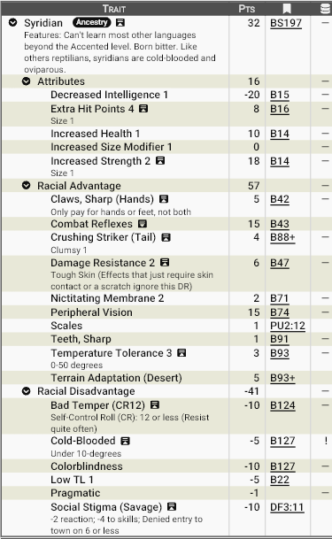

# **Syridianos - o povo lagarto do deserto**

Os syridianos são uma raça reptiliana nascida nas regiões mais inóspitas do deserto. Moldados pelo calor implacável, pela escassez de recursos e por uma cultura brutal de sobrevivência, tornaram-se guerreiros temidos até mesmo por outros povos acostumados às areias. Sua sociedade é antiga, orgulhosa e profundamente ligada à ideia de força, resistência e domínio territorial. Para civilizações mais “suaves”, eles são vistos como bárbaros; para os próprios syridianos, são simplesmente aquilo que a natureza exige que sejam para sobreviver.

## **Aparência**

Os syridianos possuem forma humanoide reptiliana robusta e musculosa, com cerca de 2 metros de altura em média. Seu corpo é coberto por escamas grossas e opacas, variando entre tons de areia, ocre, vermelho-ferrugem e verde seco — cores que os camuflam perfeitamente entre dunas, rochas e cânions.

Características marcantes:

- Cauda longa e pesada usada como arma natural. 
- Cabeça alongada com focinho reptiliano e dentes afiados visíveis mesmo com a boca fechada. 
- Olhos laterais protegidos por membrana nictitante, adaptados à luz intensa e tempestades de areia. 
- Mãos e pés com garras grossas e curvas. 
- Pele espessa e endurecida que funciona como armadura natural. 
- Corpo grande e pesado (SM+1), transmitindo presença intimidadora. 

Mesmo quando imóveis, passam a impressão de predadores prontos para atacar.

## **Fisiologia**

Os syridianos são **ectotérmicos (sangue frio)**. Dependem do calor ambiental para manter o metabolismo eficiente. Em temperaturas abaixo de 10 °C tornam-se lentos, letárgicos e irritadiços. São **ovíparos**: botam ovos protegidos em ninhos subterrâneos aquecidos pelo sol. 

Possuem saúde excepcional e grande resistência física. A pele deles funciona como uma armadura natural (resistência a dano). Embora sejam daltônicos — enxergam o mundo principalmente em contrastes de brilho e calor - syridianos têm um campo de visão ampliado graças à visão periférica. Suas garras, dentes e cauda são naturalmente letais. 

São extremamente resistentes ao calor (0–50 °C sem penalidades).Portanto sua fisiologia é perfeita para o deserto, mas inadequada para climas frios ou úmidos, o que dado ao clima de Zandia, definitivamente não é um problema...

## **Psicologia**

A mente syridiana é moldada por um ambiente de escassez e perigo constante. 

Traços psicológicos típicos:

- Temperamento explosivo e pavio curto. 
- Cultura baseada em força, honra tribal e sobrevivência. 
- Pensamento direto e pragmático — pouca paciência para abstrações complexas. 
- Valorizam coragem, resistência e domínio físico. 
- Confiam mais em ações do que em palavras. 
- Possuem dificuldade em aprender idiomas estrangeiros. 
- Respeitam profundamente guerreiros fortes, independentemente da origem. 

Para eles, o mundo é simples: predadores, presas e aqueles que ainda não provaram seu valor.

## **Ecologia**

Os syridianos ocupam desertos extremos onde poucas espécies sobrevivem. Eles são predadores dominantes das regiões áridas, habitantes de cavernas, cânions e ruínas enterradas. Caçam grandes animais do deserto e realizam incursões tribais. 

Como são muito bem adaptados a longos períodos de escassez de água, movem-se com facilidade em areia profunda e calor extremo. Assim, conseguem prosperar em locais inóspitos onde outros povos tem dificuldade de sobreviver.

## **Relações com Outras Raças**

Os syridianos carregam o estigma social de bárbaros. Povos civilizados os temem e evitam; comerciantes negociam apenas quando necessário. Elfos, Tressi, Krin e outros povos que habitam o deserto os respeitam — mesmo quando os odeiam.  Tribos bárbaras os consideram guerreiros dignos. 

Por outro lado, syridianos veem os outros, em especial aqueles que vivem nas cidades-estado como frágeis e dependentes. Respeitam força individual acima de origem cultural. No entanto, podem tornar-se aliados leais após provarem respeito mútuo. 

Um syridiano raramente é amado — mas frequentemente é respeitado.

## **Papel em Zandia**

Os syridianos são os verdadeiros nativos do deserto profundo de Zandia. Enquanto as cidades-estado lutam para sobreviver ao mundo moribundo, eles prosperam nele e dominam as regiões mais inóspitas, funcionando como uma barreira natural à expansão da civilização. 

São temidos predadores, guardiões involuntários de rotas e ruínas antigas e um lembrete vivo de que o futuro climático do mundo pode pertencer a espécies adaptadas ao calor extremo — não às raças civilizadas.
________________________________________

## **Por que os syridianos se tornam aventureiros?**

Para os syridianos, abandonar a tribo e vagar pelo mundo é algo incomum. Sua cultura valoriza a força do clã, a proteção dos territórios ancestrais e a sobrevivência coletiva diante das adversidades do deserto. A maioria passa a vida inteira entre seus semelhantes, caçando, guerreando e defendendo os recursos que garantem a continuidade de sua linhagem.

Ainda assim, existem circunstâncias em que um syridiano é levado a trilhar os caminhos da aventura. Alguns são enviados em missões importantes para suas tribos, outros buscam provar seu valor através de grandes feitos, enquanto alguns poucos são forçados a deixar suas terras por exílio, derrota ou tragédia. Em uma cultura onde o respeito é conquistado por ações e não por palavras, aventurar-se pelas regiões mais perigosas de Zandia é uma das formas mais honrosas de demonstrar força, coragem e determinação.

Muitos estrangeiros acreditam que os syridianos viajam motivados apenas pela violência ou pela conquista. Embora alguns realmente busquem glória em combate, a verdade é que suas motivações costumam ser muito mais profundas: proteger sua tribo, garantir recursos para seu povo, honrar ancestrais ou enfrentar ameaças que colocam em risco as terras que chamam de lar.

A seguir algumas ideias de razões pelas quais um syridiano pode tornar-se um aventureiro em Zandia:

- **Provação do Guerreiro:** Antes de ser reconhecido como adulto ou líder, o syridiano deve enfrentar os perigos do mundo e retornar com provas de sua força.
- **Caçador de Grandes Presas:** Criaturas lendárias do deserto são símbolos de prestígio. Abater uma delas pode garantir fama eterna entre seu povo.
- **Campeão da Tribo:**  Escolhido pelos anciões para representar os interesses do clã perante outras tribos ou povos estrangeiros.
- **Explorador das Terras Perdidas:** Ruínas antigas emergem constantemente das areias de Zandia. Alguns são enviados para encontrar conhecimento, armas ou segredos esquecidos.
- **Guardião de uma Relíquia Ancestral:** Certos artefatos possuem enorme importância cultural. Recuperá-los ou protegê-los é uma honra sagrada.
- **Busca por Recursos para o Clã:** Água, alimentos, minerais ou tecnologia perdida podem significar a sobrevivência de toda uma tribo.
- **Exilado em Busca de Redenção:** Após uma falha grave ou derrota humilhante, o guerreiro é banido até provar novamente seu valor.
- **Vingador de uma Tribo Destruída:** Uma tribo rival, monstros ou forças antigas aniquilaram seu povo. A vingança tornou-se seu propósito.
- **Mercenário das Areias:** Alguns oferecem sua força em troca de riqueza, armas ou influência para beneficiar seu clã.
- **Peregrino dos Ancestrais:** Guiado por sonhos, tradições ou profecias, viaja para locais sagrados ligados às origens de seu povo.
- **Emissário Tribal:** Apesar de raros, alguns syridianos são enviados para negociar alianças, acordos ou tréguas.
- **Conquistador de Territórios:** Busca novas terras para sua tribo se expandir e prosperar.
- **Sobrevivente de uma Catástrofe:** Sua tribo foi destruída por seca, guerra ou desastre natural, obrigando-o a encontrar um novo propósito.
- **Guardião Contra uma Ameaça Antiga:** Ruínas e lendas do deserto falam de horrores adormecidos. Alguns guerreiros dedicam suas vidas a impedir seu retorno.

Independentemente da razão, um syridiano aventureiro carrega consigo os valores de seu povo: força, resistência, honra e sobrevivência. Onde outros enxergam apenas ruínas, monstros e desertos mortais, ele vê oportunidades para provar seu valor e deixar sua marca sob o sol impiedoso de Zandia.

## <u>**Estatística**</u>

### **Modelo Racial**: Syridianos

**Pontuação total**: 32 pontos

**Modificadores de atributos**: ST+2, IQ-1, HT+1, HP+4 SM+1

**Vantagens raciais:**

- Combat Reflexes
- Damage Resistance (Tough Skin)+2
- Nictating Membrane+2
- Peripheral Vision
- Temperature Tolerance+3
- Terrain Adaptation: Desert
- Sharp Claw
- Sharp Teeth

**Qualidades (Perks) raciais:**

- Scales

**Desvantagens raciais:**

- Bad Temper (CR12)
- Cold-Blooded
- Low TL-1
- Social Stigma: Savage (CR12)
- Social Stigma: Minority Gtoup

**Pecurialidades (Quirks) raciais:**

- Pragmatic

#### **Print do GCS:**

________________________________________

#### **Download do modelo racial (Arquivo .GDF):**

Para baixar o arquivo de template do GCS <a href="/assets/templates/syridian.gct" download> 📥 Clique Aqui </a>

________________________________________
