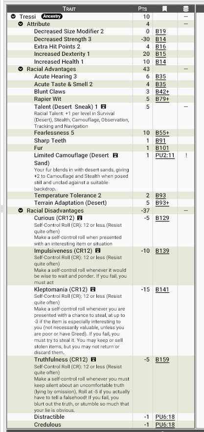

# **Os Tressi - raposinhas  do deserto de Zandia**

Em um mundo onde a curiosidade mata, os Tressi continuam vivos — o que para muitos é prova de que o deserto possui senso de humor.

Pequenos humanoides vulpinos, os Tressi são uma das presenças mais comuns — e mais irritantes — das rotas de caravanas de Zandia.

## **Aparência**

Os Tressi lembram fennecs ou raposinhas bípedes, com uma altura entre 90 cm a 1,20 m. Um corpo leve com ossos finos, orelhas grandes e móveis, além de uma cauda volumosa usada para equilíbrio e expressão emocional. Seus grandes olhos são brilhantes e inquietos. 

Seu corpo é coberto por pelagem curta e densa que protege do calor extremo, reduz perda de água e camufla naturalmente. A cor dessa pelagem pode assumir vários tons: bege claro, marfim, dourado pálido e areia quente. Essa coloração não é coincidência: ela praticamente desaparece nas dunas de sílica de Zandia. Quando imóveis, Tressi podem parecer apenas pequenas formações de areia soprada.

Seus Dentes são afiados e suas pequenas garras mostram que, apesar da aparência fofa, são onívoros oportunistas.

## **Fisiologia**

Os Tressi são criaturas do calor extremo. Extremamente adaptados ao calor e areia quente do deserto. Tem um senso de direção excepcional e audição e olfato aguçados.

Eles se movem com incrível leveza, deixando rastros quase invisíveis. Sua constituição física é curiosa: fisicamente fracos mas surpreendentemente resistentes, difíceis de derrubar ou exaurir. Parecem frágeis… até sobreviverem a situações que matariam aventureiros experientes.

## **Psicologia**

A mente Tressi é o verdadeiro motivo de sua fama.

Eles são definidos por um conjunto de impulsos quase universais:

### **Curiosidade compulsiva**

Tressi sentem desconforto real diante do desconhecido. Portas fechadas, objetos estranhos, conversas sussurradas — tudo exige investigação imediata. Eles chamam isso de “Coceira do Destino”.

### **Apropriação espontânea**

Tressi não se veem como ladrões. Eles acreditam que objetos: “se perdem das pessoas antes das pessoas perceberem”. Qualquer item “interessante e desacompanhado” corre risco de ser “resgatado”. É óbvio que as outras raças não vêem essa característica da mesma forma...

### **Língua ferina**

Tressi são incapazes de manter filtros sociais por muito tempo. Eles sempre dizem o que pensam e perguntam o que ninguém pergunta, apontando o óbvio constrangedor. Não fazem isso por maldade — mas por absoluta falta de noção social.

### **Ausência de pânico**

Tressi não travam diante do perigo. Eles entendem o risco, mas raramente entram em pânico. Isso cria aventureiros naturais… e estatísticas de mortalidade estranhamente baixas.

### **Distração e credulidade**

Eles se distraem facilmente e tendem a acreditar no que lhes contam — desde que pareça interessante. Essa combinação faz deles exploradores incríveis porém por causa dessa inerente ingenuidade são péssimos conspiradores.

## **Ecologia**

Tressi não constroem cidades, eles não se preocupam com esses detalhes. Embora existam comunidades Tressi espalhadas até mesmo em algumas cidades, eles preferem uma vida livre e em constante movimento. Assim muitos vivem em caravanas errantes percorrendo rotas comerciais esquecidas (ou não)  e em acampamentos temporáros dentro de ruinas abandonadas, cavernas, ou qualquer lugar que possar ser usado como abrigo.

São onívoros oportunistas, se alimentando de pequenos animais, insetos, raizes e até mesmo de restos de caravanas. Sua verdadeira especialidade, porém, é sobreviver viajando. Muitos servem como guias de deserto, batedores, mensageiros ou exploradores de ruínas no deserto.

## **Relações com Outras Raças**

A maioria das raças de Zandia (com ênfase nos humanos) consideram os Tressi ladrõezinhos irritantes, perigosos perto de objetos de valor, mas úteis como guias. Há um ditado comum: ***“Se perdeu algo, procure um Tressi. Se encontrou algo, esconda de um Tressi.”**

Em especial os mercadores têm uma relação de amor e ódio com os tressi. São os inúmeros casos de tressis que por causa de uma mera "apropriação indébita" criam confusão com um caravana inteira. Contudo, para eles um tressi é um mal necessário. São excelentes batedores de rotas, no entanto, péssimos para se manter perto da carga. Pior ainda se esta carga for valiosa, mesmo que o tressi não ligue para isso!

Uma curiosidade: alguns sacerdotes e místicos acreditam que os Tressi são tocados pelo destino ou pelo próprio deserto.Há inúmeros cultos espalhados por Zandia que adoram essas pequenas criaturas. Alguns mais radicas acreditam que a cauda de um tressi traz boa sorte... Outrossim. há aqueles que não vêem com bons olhos os tressi: uma praga divina, um incômodo que não deveria existir. 

Não obstante grande parte das raças tenha suas ressalvas com os Tressi, há uma que representa uma exceção à regra: Elfos Cinzentos. Pela sua própria natureza nômade, elfos genuinamente gostam dos tressi. Elfos e Tressi compartilharem o mesmo estilo de vida: uma mobilidade constante, vivendo nas mesmas rotas. Elfos valorizam o que um tressi pode fornecer: a informação do deserto e o auxílio na exploração de rotas desconhecida. Entre caravanas élficas, Tressi são comuns como exploradores, mensageiros e até mesmo contadores de histórias. 

Elfos dizem:  
***“Eles falam demais, pegam demais e perguntam demais.  
Mas sempre voltam com as respostas.”***

## **Papel em Zandia**

Em um mundo brutal e implacável como Zandia, os Tressi são a prova viva de que: a curiosidade pode ser uma forma de sobrevivência. Eles não dominam cidades, não lideram impérios e raramente acumulam riquezas. Mas ninguém conhece as rotas, ruínas e segredos de Zandia melhor que eles

________________________________________

## **Por que os tressi se tornam aventureiros?**

### **O Chamado da Coceira do Destino:**

A maioria dos Tressi não entende por que outras raças passam a vida inteira no mesmo lugar.

Para eles, o mundo está cheio de ruínas não exploradas, histórias não ouvidas, segredos não descobertos e objetos interessantes que claramente precisam ser examinados de perto. Permanecer parado por muito tempo parece tão estranho quanto viver sem água.

Diferentemente de outras raças, os Tressi raramente se tornam aventureiros por dever, honra, riqueza ou glória. Na verdade, muitos sequer planejam tornar-se aventureiros. Eles simplesmente seguem uma trilha interessante, investigam uma ruína misteriosa, acompanham uma caravana por curiosidade ou tentam descobrir o que existe além da próxima duna. De alguma forma, isso inevitavelmente acaba levando-os a aventuras.

Os próprios Tressi chamam esse impulso de **"Coceira do Destino"**: uma inquietação constante que surge sempre que existe algo desconhecido por perto. Alguns tentam resistir. Nenhum consegue por muito tempo.

Sua curiosidade quase sobrenatural, combinada com sua habilidade de sobreviver nos lugares mais perigosos de Zandia, faz deles exploradores naturais. Muitos acabam conhecendo mais sobre ruínas antigas, rotas esquecidas e lendas do deserto do que estudiosos que passaram décadas pesquisando.

Outras raças costumam considerar os Tressi irresponsáveis, inconvenientes ou simplesmente incapazes de ficar longe de problemas. Os próprios Tressi costumam responder que não procuram problemas. Os problemas é que parecem gostar de segui-los. 

Breves exemplos de motivação:

- **Seguir a Coceira do Destino**: Existe algo desconhecido por perto. Isso já é motivo suficiente.
- **Descobrir o que Existe Além da Próxima Duna**: O horizonte está lá. Naturalmente, ele precisa descobrir o que há depois dele.
- **Explorar uma Ruína Misteriosa**: Se ninguém entrou lá nos últimos mil anos, certamente existe um motivo interessante.
- **Encontrar um Objeto Interessante**: Uma espada estranha, um artefato antigo ou uma pedra brilhante podem desencadear uma aventura inteira.
- **Trabalhar como Guia de Caravanas**: Poucas raças conhecem tão bem as rotas do deserto quanto os Tressi.
- **Mensageiro das Rotas Distantes**: Rápidos, discretos e resistentes, são excelentes para transportar informações entre assentamentos distantes.
- **Caçador de Histórias**: Alguns viajam apenas para ouvir lendas, coletar contos e conhecer culturas diferentes.
- **Procurador de Segredos**: Segredos escondidos incomodam profundamente um Tressi. Eles precisam ser descobertos.
- **Recuperador de Tesouros Perdidos**: Nem sempre por ganância. Muitas vezes ele simplesmente quer saber quem os perdeu e por quê.
- **Acompanhante de Elfos Nômades**: As caravanas élficas oferecem oportunidades infinitas para viajar, explorar e ouvir histórias.
- **Cartógrafo das Areias**: Alguns dedicam suas vidas a registrar rotas, oásis e ruínas que surgem e desaparecem sob as dunas.
- **Procurar um Amigo Desaparecido**: Tressi costumam formar amizades fortes e inesperadas. Alguns cruzariam metade de Zandia para ajudar alguém importante.
- **Fugir de Problemas que Ele Mesmo Criou**: Talvez tenha pegado algo que não deveria. Talvez tenha feito uma pergunta errada. Talvez ambas as coisas.
- **Encontrar um Lugar Lendário**: Cidades perdidas, templos enterrados e oásis míticos são irresistíveis para sua curiosidade.
- **Provar que Aquela História Era Verdade**: Quando alguém diz que algo é impossível, um Tressi imediatamente considera isso um desafio.

Seja qual for a sua motivação, um Tressi aventureiro raramente busca poder ou riqueza. O que ele procura é muito mais valioso aos seus olhos: a próxima descoberta, a próxima história e o próximo mistério escondido sob as areias de Zandia. Afinal, o mundo é grande demais para ficar parado... e há sempre alguma coisa interessante logo ali, depois da próxima duna.

## <u>**Estatística**</u>

### **Modelo Racial**: Tressi

**Pontuação total**: 10 pontos

**Modificadores de atributos**: ST-3, DX+1, HT+1, HP+2 SM-2

**Vantagens raciais:**

- Acute Hearing+3
- Acute Taste & Smell+2
- Blunt Claws
- Rapier Wit
- Fearlesness+5
- Sharp Teeth
- Talent: Desert Sneak+1
- Temperature Tolerance+2
- Terrain Adaptation: Desert

!!! info "Talent: Desert Sneak ou Talento: Caminhante do Deserto"
      Confere bônus de +1 por nível em Survival (Desert), Stealth, Camouflage, Observation, Tracking e Navigation (Land). +1 (por nível) em HT para resistir o clima e a temperatura do deserto.

**Qualidades (Perks) raciais:**

- Fur
- Limited Camouflage: Desert Sand

!!! info "Limited Camouflage: Desert Sand ou Camuflagem Limitada: Areia do Deserto"
      Sua pelagem se mistura naturalmente às areias do deserto, concedendo +2 em Camouflage e Stealth quando você permanece imóvel e sem roupas sobre um terreno ou fundo adequado.

**Desvantagens raciais:**

- Curious (CR12)
- Impulsiveness (CR12)
- Kleptomania (CR12)
- Truthfulness (CR12)

**Pecurialidades (Quirks) raciais:**

- Distractible
- Credulous

#### **Print do GCS:**

________________________________________

#### **Download do modelo racial (Arquivo .GDF):**

Para baixar o arquivo de template do GCS <a href="/assets/gdf/tressi.gdf" download> 📥 Clique Aqui </a>

________________________________________
