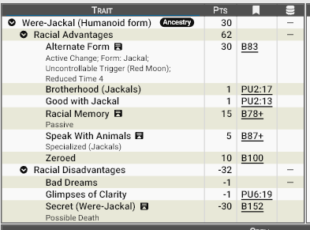
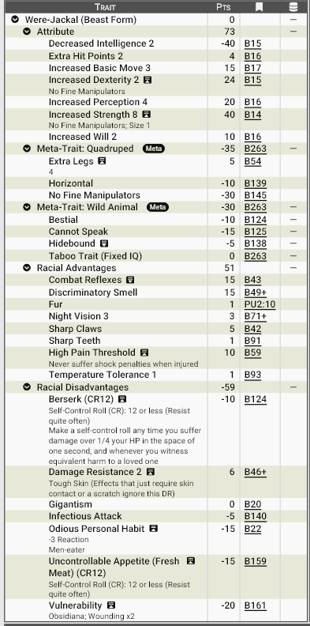

# **Homens Chacal, portadores da maldição da Lua Vermelha**

!!! info "**Importante:**"
      Esse modelo racial pode ser acumulado com modelos de outras raças.

Os Homens-Chacal são uma raça de metamorfos que assumem a forma de um animal: o chacal. Definitivamente não são uma raça natural — são uma maldição viva. Nenhum nasce assim; eles são criados quando uma criatura é ferida pela besta e sobrevive para carregar o sangue amaldiçoado. Ao despertar, o novo portador descobre que herdou algo muito mais profundo que uma transformação física: ele passa a fazer parte de uma memória coletiva ancestral, compartilhada por todos os homens-chacal que já existiram.

Essa ligação com os chacais é visceral e sobrenatural. Eles sentem empatia pelos animais, conseguem caminhar entre eles sem serem atacados e até se comunicar de forma instintiva. Porém, essa conexão cobra um preço terrível: sonhos vívidos de massacres passados, vislumbres de vidas que não viveram e lembranças que emergem sem aviso — fragmentos de uma história sangrenta que nunca termina.

Perseguidos por todas as civilizações, vivem como viajantes misteriosos e errantes, sempre à margem da sociedade.

## **Aparência**

Na forma humanóide eles mantém a aparência de sua raça original. Na forma animal, aparentam um chacal, porém maior e mais selvagem.

## **Fisiologia**

Os homens-chacal possuem duas formas distintas:

### **Forma Humanoide**

Fisicamente indistinguíveis de membros de sua raça original, embora frequentemente apresentem um desses traços sutis (que não constam no modelo racial, mas podem ser comprados como características distintas, peculiaridades ou mesmo vantagens):

- Olhos amarelados ou âmbar.
- Caninos ligeiramente alongados. 
- Movimentos silenciosos e postura predatória. 
- Olfato e audição acima do normal. 

Eles carregam a maldição no sangue, invisível à maioria das formas de detecção mágica. Magias que buscam identidade verdadeira ou passado falham; sua história está velada por forças sobrenaturais.

### **Forma Bestial**

A transformação voluntária leva apenas um instante, mas exige que estejam nus — roupas e objetos não se transformam e normalmente são destruídos.

Na forma bestial, eles se tornam predadores imponentes do deserto, com  um corpo maior e musculoso, semelhante a um chacal gigante. Suas fortes mandíbulas são capazes de esmagar ossos. Seus sentidos ficam extremamente aguçados. Ganham resistência e velocidade elevadas. 

Durante a Lua Vermelha, a transformação é automática e incontrolável. Nessa noite, a criatura perde completamente a razão e entra em um frenesi assassino, caçando até saciar sua fome de carne humana.

## **Psicologia**

A mente de um homem-chacal é marcada por duas forças conflitantes:

### **Memória Compartilhada**

Homens chacais podem acessar lembranças de todos aqueles que compartilham a maldição, revivendo experiências passadas e tendo acesso a informações que outros homens-chacal viveram. Porém, isso está além de seu controle e essas memórias carregam ecos de todos os massacres realizados por sua linhagem. Esses fragmentos surgem como sonhos violentos, déjà-vus perturbadores ou flashbacks desencadeados por lugares ou situações. 

Essas lembranças podem ou não ser úteis; algumas podem fornecer informações interessantes enquanto outras são apenas distrações dolorosas que reforçam a sensação de identidade fragmentada.

### **Dualidade Predatória**

Vivem em constante tensão entre razão e instinto:

- Parte deles busca sobrevivência e aceitação. 
- Outra parte deseja caça, sangue e liberdade. 

Muitos desenvolvem personalidades solitárias, desconfiadas e melancólicas. A culpa pelas mortes cometidas durante a Lua Vermelha pesa sobre eles, mesmo que não tenham controle.

## **Ecologia**

Homens-chacal são nômades por necessidade. Eles raramente permanecem muito tempo no mesmo lugar, pois sempre serão caçados por caçadores de monstros e ordens religiosas. Pela sua natureza bestial prestes a explodir, podem colocar comunidades inteiras em risco durante a Lua Vermelha. Além disso, devido a seu instinto de predador, precisam de territórios vastos para caçar e sobreviver. 

Frequentemente vivem longe de outros humanóides, solitários ou, raramente, em comunidades de semelhantes, em desertos e terras áridas, em ruínas antigas e em em rotas de caravanas abandonadas. Sua ligação com chacais reais faz com que muitas vezes viajem acompanhados por matilhas.

## **Relações com Outras Raças**

Quase todas as culturas veem os homens-chacal como monstros inevitavelmente perigosos. Eles são temidos e perseguidos, associados a massacres e desaparecimentos. Ordens religiosas frequentemente os caçam. Povos civilizados raramente lhes concedem abrigo. 

De outra sorte, são difíceis de identificar, uma vantagem crucial:

- São impossíveis de rastrear por adivinhação baseada em identidade. 
- Podem viver como estrangeiros misteriosos por anos. 
- Só podem ser localizados por objetos pessoais ou contato direto. 

Alguns poucos indivíduos conseguem formar laços com aventureiros ou mercenários — grupos que valorizam utilidade acima de preconceito.

## **Papel em Zandia**

Em Zandia, os homens-chacal representam o arquétipo do **errante amaldiçoado do deserto**.

Eles ocupam um papel narrativo importante:

- Sobreviventes entre civilização e selvageria. 
- Guias perigosos das terras desoladas. 
- Anti-heróis solitários. 
- Predadores temidos nas noites de Lua Vermelha. 

Podem surgir como mercenários discretos, exploradores de ruínas antigas, caçados tentando fugir do próprio destino e mesmo monstros lendários que aterrorizam caravanas. Os homens-chacal são a lembrança viva de que, em Zandia, a linha entre homem e besta é perigosamente fina.

________________________________________

## **Por que os homens-chacal se tornam aventureiros?**

## <u>**Estatística**</u>

### **Modelo Racial**: Homem-Chacal (Forma humanoide)

**Pontuação total**: 30 pontos

**Vantagens raciais:**

- Alternate Form (Active change; Form: Jackal; Uncontrollable Trigger: Red Moon, Reduced Time 4)
- Racial Memory (Passive)
- Speak with Animals (Specialized: Jackals)
- Zeroed

**Qualidades (Perks) raciais:**

- Brotherhood (Jackals)
- Good with Jackals

!!! info "Brotherhood (Jackals) ou Irmandade (Chacais)"
       Chacais não necessariamente gostam de você, mas o ignoram se você não for hostil e estiver visível. Eles o empurram para o lado para alcançar presas ou objetivos. Se você interferir ou agir com hostilidade, passa a ser considerado um alvo válido. Em resposta ao respeito demonstrado, tendem a reagir de forma neutra ou favorável, exceto quando possuem comportamento predeterminado ou estão sob controle sobrenatural.

**Desvantagens raciais:**

- Secret (Werejackal, Possible Death)

**Pecurialidades (Quirks) raciais:**

- Bad Dreams
- Glimpses of Clarity

#### **Print do GCS:**

### **Modelo Racial**: Homem-Chacal (Forma Animal)

**Pontuação total**: 0 pontos

**Modificadores de atributos**: ST+8 (No fine manipulators; SM+1), DX+2 (no fine manipulators)+2, IQ-2,  Will+2, Per+2, HP+2, Basic Move+3, SM+1

**Metacaracterísticas:** 

<ul>
  <li><b>Quadruped</b>:
    <ul>
      <li>Extra Legs 4</li>
      <li>Horizontal</li>
      <li>No Fine Manipulators</li>
    </ul>
  </li>
</ul>

<ul>
  <li><b>Wild Animal</b>:
    <ul>
      <li>Bestial</li>
      <li>Cannot Speak</li>
      <li>Hidebound</li>
    </ul>
  </li>
</ul>

**Vantagens raciais:**

- Combat Reflexes
- Damage Resistance (Tough Skin)
- Discriminatory Smell+2
- Hight Pain Threshold
- Night Vision+3
- Sharp Claws
- Sharp Teeth
- Temperature Tolerance+1

**Qualidades (Perks) raciais:**

- Fur

**Desvantagens raciais:**

- Berserk (CR12)
- Gigantism 
- Infectious Attack 
- Odios Personal Habit: Men-eater 
- Uncontrolable Appetite (Fresh Meat) (CR12)
- Vulnerability (Obsidian, Wounding x2)

#### **Print do GCS:**

________________________________________

#### **Download do modelo racial (Arquivo .GDF):**

Para baixar os arquivos de templates do GCS <a href="/assets/templates/werejackal.zip" download> 📥 Clique Aqui </a>

________________________________________
