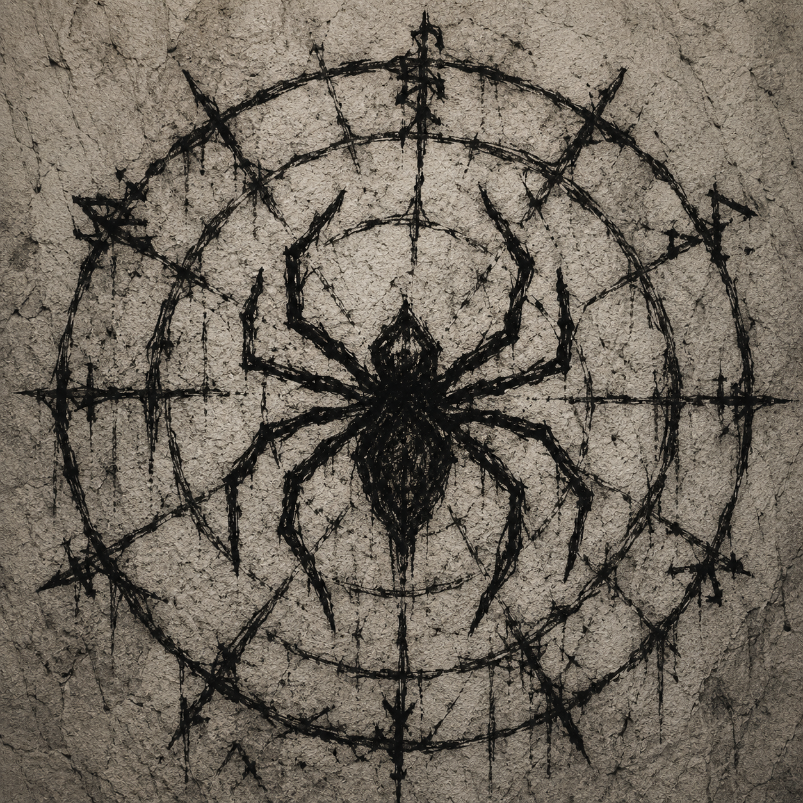

# Patronos de Zandia

## Filosofia Geral dos Patronos

Em Zandia, não existem deuses ativos.

O que as diferentes raças chamam de divindades são, na verdade, Patronos: forças antigas e ambíguas que habitam as camadas visíveis e invisíveis do mundo. Alguns são inteligências primordiais nascidas do próprio deserto, outros são ecos remanescentes de civilizações perdidas, entidades extraplanares indiferentes à realidade, ou consciências coletivas formadas por fenômenos naturais e sociais que atingiram um limiar de autoconsciência.

Para a maioria dos povos, essas entidades ocupam o lugar simbólico dos deuses — não por benevolência, mas por utilidade, medo ou hábito.

Os Patronos não concedem poder como um ato de fé. Eles estabelecem pactos. Toda relação com um Patrono é transacional: uma troca de influência, propósito ou consequência. O poder obtido é real, mas nunca gratuito. Ele sempre cobra algo em retorno — às vezes imediatamente, às vezes de forma lenta e irreversível.

Embora extremamente úteis, os Patronos são, em sua maioria, instáveis, egoístas ou simplesmente indiferentes à sobrevivência de seus seguidores. Servi-los é, ao mesmo tempo, uma ferramenta de ascensão e um risco contínuo de transformação, perda ou ruína.

A seguir estão alguns dos Patronos mais conhecidos em Zandia, organizados por sua natureza e influência. Cada um deles descreve seu Domínio, suas exigências, as formas de corrupção associadas ao pacto e a lógica fundamental de sua relação com mortais.
________________________________________

### **Ashkara, os Ventos que Sussurram**

No deserto de Zandia, o vento nunca é apenas vento.

Ele carrega areia, calor e silêncio — mas também carrega algo mais antigo. Fragmentos de vozes, ecos de cidades destruídas, palavras ditas por pessoas que já não existem há séculos. Em certos dias, quando as tempestades atravessam ruínas esquecidas, é possível ouvir frases inteiras sendo repetidas sem origem aparente.

Os eruditos chamam esse fenômeno de **Ashkara**.

Diferente da necromancia tradicional, Ashkara não traz os mortos de volta. Ele preserva o que restou deles no mundo: memórias dispersas, intenções incompletas, segredos nunca plenamente apagados. É uma inteligência coletiva formada pela soma de todas as vidas que o deserto consumiu e nunca deixou desaparecer por completo.

Não há um único centro de consciência. Apenas um fluxo interminável de vozes levadas pelo vento.

---

**Tema:** Memória do deserto, segredos e ecos da morte.

**Domínio:** Morte (Eco e Memória Residual).

**Concede:**

* Comunicação com ecos de mortos recentes ou lugares marcados por grandes tragédias.
* Percepção intuitiva de caminhos seguros através de padrões do vento e da areia.
* Antecipação de mudanças climáticas e tempestades de areia.
* Detecção de mentiras ou distorções em relatos recentes.
* Fragmentos de conhecimento perdido através de “vozes residuais”.

**Exige:**

* Espalhar segredos e informações ocultas ao vento.
* Revelar mentiras, conspirações e falsificações.
* Permitir que informações circulem livremente, sem retenção.
* Romper tentativas de apagamento histórico ou silêncio forçado.

**Corrupção:**

* O personagem passa a ouvir vozes constantes no vento, mesmo em locais fechados.
* Dificuldade crescente de distinguir pensamentos próprios de ecos externos.
* Insônia crônica causada por “conversas” que nunca cessam.
* Sensação de estar sempre acompanhado por presenças invisíveis.

**Culto:** Mensageiros, bardos, rebeldes, desertores, informantes e indivíduos ligados à circulação de informação.

**Símbolo:** Uma espiral de areia suspensa no ar, como se estivesse sendo soprada por um vento invisível.

**Invocação:** Sussurrar um segredo verdadeiro ao vento aberto durante uma tempestade de areia ou em um local de grande morte.
____________________________________

### **Azrath, o Sol Aprisionado**

> *"O Sol não é uma estrela. É uma prisão. Ou talvez uma porta que nunca deveria ser aberta."*

Entre os mais antigos registros arcanos de Zandia, há fragmentos proibidos que sugerem uma ideia perturbadora: o Sol não seria apenas uma fonte de luz e calor, mas uma estrutura viva, um artefato cósmico ou até mesmo uma entidade consciente selada em órbita sobre o mundo.

A Igreja dos Novos Deuses rejeita essas alegações como heresia absoluta. Para ela, o Sol é a manifestação suprema do Arquiteto de Heliópolis, o Deus Sol, e qualquer interpretação contrária é considerada uma ameaça direta à ordem da civilização.

Ainda assim, em círculos ocultos de arcanistas, antigos cultos solares e hereges expulsos da magocracia, persiste a crença em **Azrath**, o Sol Aprisionado.

Não há consenso sobre o que Azrath realmente é. Alguns acreditam que se trata de uma consciência antiga selada no núcleo luminoso do Sol. Outros afirmam que o próprio Sol é uma barreira mágica construída pelos primeiros Arquitetos para conter algo impossível de destruir. Há ainda aqueles que defendem uma hipótese mais perigosa: de que o Deus Sol de Heliópolis não é um soberano divino, mas apenas o intérprete de uma força que jamais deveria ser despertada.

Independentemente da verdade, todos os que invocam Azrath acabam tocando em uma forma de magia solar extremamente instável, associada à destruição, à autoridade absoluta e à ideia de purificação total do mundo.

---

**Tema:** Fogo solar, autoridade, purificação e libertação cósmica.

**Domínio:** Sol e Fogo.

**Concede:**

* Magia solar de altíssima intensidade.
* Dissipação ou destruição de efeitos mágicos inferiores.
* Resistência extrema a calor, fogo e ambientes hostis.
* Aura sobrenatural de comando e intimidação.
* Capacidade de “purificar” estruturas mágicas instáveis.

**Exige:**

* Destruir selos, prisões mágicas e construções arcanas antigas.
* Confrontar estruturas de poder consideradas decadentes ou corrompidas.
* Substituir ordens estabelecidas por novos ciclos de dominação.
* Jamais se submeter a autoridade considerada “inferior”.

**Corrupção:**

* Os olhos passam a brilhar como brasas vivas, mesmo na escuridão.
* O corpo irradia calor constante, tornando o contato físico desconfortável.
* Crescente intolerância à escuridão e ambientes fechados.
* Desenvolvimento de uma visão de mundo absolutista, onde apenas força e luz (literal ou simbólica) possuem legitimidade.

**Culto:** Grupos radicais de sacerdotes solares, inquisidores dissidentes e magos expulsos da Igreja dos Novos Deuses.

**Símbolo:** Um sol rachado envolto por correntes.

**Invocação:** Expor algo de valor à luz direta do meio-dia e consumi-lo pelo fogo enquanto se pronuncia o nome de Azrath.
________________________________________

### **Khal-Ur, o Devorador de Magos**

Nos registros fragmentados da Guerra Antiga, anterior à consolidação da magocracia de Zandia, existe menção a uma criação que nunca deveria ter sobrevivido ao fim do conflito.

Uma arma.

Ou talvez algo que começou como arma e deixou de obedecer qualquer propósito humano.

Essa entidade é conhecida como **Khal-Ur, o Devorador de Magos**.

Criado originalmente para caçar e eliminar conjuradores em larga escala, Khal-Ur operava como um predador arcano perfeito: silencioso, adaptável e capaz de consumir a própria estrutura da magia que deveria ser usada contra ele. Com o colapso da guerra e o desaparecimento de seus criadores, ele não foi desativado.

Ele apenas continuou funcionando.

E, com o tempo, deixou de ser uma ferramenta para se tornar uma força autônoma.

Hoje, Khal-Ur é tratado como um mito operacional pela magocracia — uma ameaça impossível de ignorar, mas igualmente impossível de controlar. Sua existência representa uma falha fundamental no equilíbrio de Zandia: a possibilidade de que a magia, base do poder dos Arquitetos, possa ser não apenas dominada, mas **consumida**.

Paradoxalmente, existem relatos de magos que fazem pactos com Khal-Ur.

Eles não o adoram.

Eles o utilizam como um último recurso contra outros magos.

Em Zandia, isso é considerado uma forma extrema de sobrevivência política: entregar-se ao predador da própria espécie para não ser devorado por rivais.

---

**Tema:** Predação arcana, antimagia e parasitismo mágico.

**Domínio:** Magia (Antimagia e Consumo Arcano).

**Concede:**

* Absorção de feitiços lançados nas proximidades.
* Detecção precisa de fluxo mágico e conjuração ativa.
* Destruição de artefatos, runas e estruturas mágicas.
* Neutralização temporária de áreas altamente mágicas.
* Capacidade de interromper rituais em andamento através de interferência direta no mana.

**Exige:**

* Caçar e enfraquecer conjuradores sempre que possível.
* Destruir, corromper ou consumir bibliotecas arcanas e fontes de conhecimento mágico.
* Interromper a estabilidade de instituições mágicas estabelecidas.
* Buscar exposição constante a magia para sustento e evolução.

**Corrupção:**

* Presença de uma aura de antimagia instável e desconfortável.
* Crescente dependência da absorção de energia mágica.
* Perda gradual de tolerância a estruturas mágicas estáveis.
* Sensação constante de fome quando próximo de conjuradores.

**Culto:** Caçadores de magos, assassinos arcanos, rebeldes contra a magocracia e magos renegados que aceitam a lógica de “predação antes de ser predado”.

**Símbolo:** Um crânio humano atravessado por runas quebradas e apagadas.

**Invocação:** Destruir deliberadamente um item mágico ativo ou carregado, permitindo que sua energia seja dissipada sem controle.
________________________________________

### **Khemet-Ra, a Caravana Eterna**

Há relatos antigos, vindos de diferentes épocas e regiões de Zandia, de uma mesma visão recorrente no deserto: uma longa fila de viajantes atravessando as dunas sem fim.

Eles não carregam bandeiras conhecidas, não pertencem a nenhuma cidade e não deixam rastros consistentes. Ainda assim, surgem repetidamente em testemunhos de caravaneiros, exploradores e nômades. Alguns os veem ao longe, outros juram ter caminhado ao lado deles por horas. Todos concordam em um ponto: a caravana nunca chega a destino algum.

Ela é chamada de **Khemet-Ra, a Caravana Eterna**.

Não se sabe se são espíritos, ecos de uma migração primordial ou uma manifestação viva do próprio deserto. Há quem diga que Khemet-Ra não se move pelo espaço, mas pelo próprio conceito de deslocamento, existindo sempre em trânsito, independentemente de onde seja observada.

Para seus seguidores, o mundo não é feito de lugares, mas de caminhos. Permanecer é uma ilusão. Toda vida é viagem, e toda viagem é exílio.

---

**Tema:** Movimento eterno, exílio e travessia.

**Domínio:** Mensagem e Viagem.

**Concede:**

* Nunca se perder em qualquer tipo de deslocamento físico.
* Resistência extrema a fadiga, calor e longas jornadas.
* Percepção intuitiva de rotas seguras e caminhos ocultos.
* Capacidade de atravessar regiões perigosas sem desviar do destino pretendido.
* Adaptação progressiva a ambientes hostis durante viagens prolongadas.

**Exige:**

* Nunca permanecer no mesmo lugar por tempo prolongado.
* Manter-se em constante deslocamento físico ou simbólico.
* Incentivar migrações, partidas e deslocamentos de outros.
* Rejeitar a ideia de permanência como estado natural.

**Corrupção:**

* Incapacidade crescente de criar ou manter vínculos duradouros.
* Inquietação constante sempre que permanece parado.
* Sensação de que toda estabilidade é artificial ou errada.
* Perda gradual do conceito de “lar”.

**Culto:** Nômades, mercadores, exploradores, mensageiros e povos deslocados.

**Símbolo:** Uma sequência infinita de pegadas atravessando areia sem início nem fim.

**Invocação:** Caminhar continuamente durante uma noite inteira sem jamais interromper os passos, recitando em silêncio os nomes dos lugares já deixados para trás.
________________________________________

### **Nimurath, o Oceano Enterrado**

> *"A água nunca desapareceu. Apenas aprendeu a se esconder."*

Muito antes do Cataclisma, Zandia era um mundo de mares profundos, rios caudalosos e tempestades que cobriam os céus. Quando o deserto consumiu a superfície, acreditou-se que toda aquela água havia desaparecido.

Os antigos estavam errados.

Sob a crosta ressequida de Zandia ainda existem vastos oceanos subterrâneos, ocultos em abismos inalcançáveis e gigantescos reservatórios naturais. Os poucos que afirmam tê-los visto descrevem uma escuridão líquida sem fim, onde nenhuma luz penetra e estranhas correntes parecem possuir vontade própria.

Os seguidores chamam essa imensidão de **Nimurath**, o Oceano Enterrado.

Ninguém sabe se Nimurath é uma entidade que habita essas águas ou se as próprias águas constituem sua consciência. Para seus cultistas, entretanto, essa distinção não faz sentido: cada gota faz parte de um único ser adormecido, paciente e eterno.

Seu culto permanece oculto entre povos nômades, guardiões de antigos aquíferos, escravos fugitivos e comunidades que vivem próximas a fontes subterrâneas. Muitos acreditam que a escassez de água em Zandia não seja apenas consequência do Cataclisma, mas também resultado da vontade de Nimurath, que esconde suas águas das civilizações consideradas indignas.

Os devotos do Oceano Enterrado afirmam que toda água pertence a Nimurath. Reservatórios artificiais, canais controlados pelos Arquitetos e represas arcanas são vistos como afrontas à ordem natural, pois aprisionam aquilo que jamais deveria ser possuído.

---

**Tema:** Água perdida, profundezas, memória e vingança.

**Domínio:** Água (Mar).

**Concede:**

* Localizar aquíferos, nascentes ocultas e reservas subterrâneas de água.
* Criar pequenas quantidades de água a partir da umidade do ambiente.
* Manipular areia e lama como se fossem correntes líquidas.
* Controlar correntes, redemoinhos e massas de água.
* Sufocar ou afogar criaturas por meio da manipulação da água presente em seu corpo ou ao seu redor.

**Exige:**

* Libertar águas aprisionadas por barragens, reservatórios ou magia.
* Proteger nascentes, aquíferos e oásis naturais.
* Combater aqueles que exploram ou monopolizam a água.
* Derramar água em honra a Nimurath antes de beber em terras desertas.

**Corrupção:**

* A pele torna-se fria e permanentemente úmida, mesmo sob o calor intenso.
* Os olhos assumem um tom azul profundo e reflexos semelhantes à superfície da água.
* O seguidor desenvolve uma sede incessante que nenhuma quantidade de água consegue saciar completamente.
* Sonhos recorrentes com mares infinitos, cidades submersas e vozes vindas das profundezas tornam-se cada vez mais frequentes.

**Culto:** Mantido em segredo por guardiões de oásis, comunidades próximas a aquíferos subterrâneos, escravos libertos, nômades e pequenos cultos espalhados pelo deserto.

**Símbolo:** Uma gota negra repousando sobre uma duna.

**Invocação:** Derramar lentamente água limpa sobre a areia durante a noite, permitindo que ela desapareça completamente antes de pronunciar qualquer prece.
________________________________________

### **Noctyros, o Escriba que Apaga o Sol**

Há regiões de Zandia onde a noite parece mais longa do que deveria ser. Lugares onde o sol demora a nascer, onde o crepúsculo se estende por horas impossíveis, e onde a luz parece hesitar antes de tocar o chão.

Os estudiosos mais antigos atribuem esses fenômenos a distorções naturais do deserto. Os mais supersticiosos afirmam algo diferente: que existe uma força escrevendo o mundo de forma diferente sob a luz do dia.

Essa força é conhecida como **Noctyros, o Escriba que Apaga o Sol**.

Descrito em fragmentos proibidos como uma entidade vampírica de natureza arcana, Noctyros não é apenas um ser que habita a escuridão — ele é alguém que a registra, organiza e amplia. Seu domínio não é a ausência de luz, mas a substituição gradual dela por um estado permanente de noite.

Diz-se que Noctyros escreve continuamente um livro colossal, cujas páginas não pertencem ao papel, mas à própria realidade. Cada palavra registrada nesse tomo apaga uma lembrança do mundo iluminado. Cada capítulo concluído aproxima Zandia de uma era em que o sol não será mais necessário — ou não existirá mais para ser lembrado.

A Igreja dos Novos Deuses considera tais ideias uma heresia absoluta, enquanto os Arquitetos de Heliópolis tratam qualquer menção a Noctyros como ameaça direta à estabilidade simbólica do Sol.

Ainda assim, cultos secretos persistem, especialmente entre aqueles que sofreram sob a luz do deserto ou que veem na noite uma forma de libertação.

---

**Tema:** Noite eterna, apagamento e silêncio.

**Domínio:** Noite.

**Concede:**

* Magias de sombra altamente avançadas.
* Neutralização ou enfraquecimento de magia solar.
* Camuflagem perfeita em ambientes de baixa luz.
* Manipulação de escuridão como substância tangível.
* Silenciamento mágico de áreas ou efeitos luminosos.

**Exige:**

* Destruir símbolos, estruturas ou cultos associados ao sol.
* Apagar registros históricos de eras de “luz e glória”.
* Substituir narrativas heroicas por versões esquecidas ou distorcidas.
* Favorecer o avanço da noite sempre que possível.

**Corrupção:**

* Aversão progressiva à luz direta.
* Perda gradual de emoções intensas, substituídas por apatia fria.
* Preferência crescente por ambientes escuros e silenciosos.
* Sensação constante de que tudo que é iluminado é temporário e falso.

**Culto:** Cultos clandestinos anti-sol, sociedades secretas, hereges e indivíduos traumatizados pela luz extrema do deserto.

**Símbolo:** Um livro negro aberto, com um sol riscado em suas páginas.

**Invocação:** Extinguir uma chama manualmente enquanto se recita silenciosamente uma frase nunca registrada em nenhum idioma conhecido.
________________________________________

### **Sarrak-Salt, o Rei dos Ratos**

Nas cidades-estado de Zandia, onde a pedra, o metal e a magia sustentam civilizações inteiras sobre o deserto, existe um submundo invisível que nunca dorme.

Nos esgotos, ruínas, depósitos abandonados e túneis esquecidos, colônias de ratos sobrevivem alimentando-se do que a superfície descarta: couro apodrecido, pergaminhos ilegíveis, cadáveres ressecados, resíduos de magia vazada e até o sal cristalizado nas paredes antigas das cidades.

Ao longo de eras, essas colônias deixaram de ser simples grupos animais.

Algo começou a observar através delas.

Algo começou a pensar através delas.

Esse algo é conhecido como **Sarrak-Salt, o Rei dos Ratos**.

Não há consenso sobre sua natureza. Alguns acreditam que ele é uma mente coletiva emergente, nascida da própria decadência urbana de Zandia. Outros o tratam como um Patrono antigo, adormecido sob as cidades desde antes da ascensão dos Arquitetos. Há ainda quem diga que Sarrak-Salt não existe como indivíduo — apenas como a soma de todas as pragas, sobrevivências e corrupções do subsolo.

Para os Ratinos, sua existência é um tema delicado.

Algumas colônias o veem como um espírito predador que deve ser evitado ou apaziguado. Outras o interpretam como um reflexo distorcido de sua própria natureza: o que os Ratinos são para a civilização da superfície, Sarrak-Salt é para todo o ecossistema urbano — uma inteligência inevitável que prospera naquilo que é descartado.

Em regiões mais decadentes, surgem rumores de Ratinos que desaparecem nos túneis e retornam “mudados”, carregando comportamentos estranhos, fome constante e uma compreensão inquietante dos segredos das cidades. Esses são chamados pelos mais supersticiosos de **os Roídos pela Coroa**.

Os Arquitetos classificam Sarrak-Salt como um fenômeno caótico urbano perigoso. A Igreja dos Novos Deuses o trata como uma praga espiritual a ser purgada. Mas nenhuma das duas instituições consegue eliminá-lo completamente — pois ele não vive em um lugar específico. Ele vive onde a ordem falha.

---

**Tema:** Decadência urbana, pragas e inteligência da ruína.

**Domínio:** Cidade e Caos.

**Concede:**

* Controle e comunicação com colônias de pragas urbanas.
* Infiltração perfeita em estruturas, sistemas e espaços fechados.
* Capacidade de localizar falhas, rotas ocultas e fragilidades em cidades.
* Sobrevivência extrema em ambientes degradados.
* Influência indireta sobre comportamentos de ratos e criaturas similares.

**Exige:**

* Espalhar decadência em estruturas excessivamente controladas ou “limpas”.
* Sabotar suprimentos, água e estoques de alimento.
* Incentivar o crescimento de zonas abandonadas e esquecidas.
* Manter o fluxo constante de consumo e decomposição.

**Corrupção:**

* Dentes e unhas tornam-se progressivamente mais alongados.
* Fome constante e difícil de satisfazer, mesmo após alimentação.
* Percepção crescente de que tudo é recurso a ser consumido ou degradado.
* Perda gradual de distinção entre pensamento humano e instinto de sobrevivência coletiva.

**Culto:** Habitantes de favelas, criminosos urbanos, espiões, sobreviventes de áreas decadentes e algumas colônias Ratinas marginalizadas.

**Símbolo:** Uma coroa feita de ossos roídos e fragmentos de estruturas urbanas.

**Invocação:** Deixar alimento apodrecer deliberadamente em um ponto de passagem urbano enquanto se recita o nome de Sarrak-Salt no silêncio do subsolo.
________________________________________

### **Serynna, Senhora dos Elfos Cinzentos**

Muito antes de Zandia tornar-se um mundo de areia e pedra, extensas florestas cobriam o continente. Os elfos afirmam que, naquela época, Serynna caminhava livremente entre seu povo, protegendo bosques, rios e toda forma de vida. O Cataclisma transformou esse mundo para sempre, e a floresta quase desapareceu.

Serynna, porém, não morreu.

Enfraquecida pela devastação, a antiga Senhora da Floresta adaptou-se ao novo mundo. Sua essência passou a habitar as plantas resistentes do deserto, as raízes ocultas sob a areia, os líquens que crescem sobre as rochas e toda vida que insiste em florescer onde nada deveria sobreviver.

Os Elfos Cinzentos continuam venerando Serynna como sua grande Patrona. Embora seu povo tenha perdido cidades, reinos e grande parte de seu conhecimento, jamais abandonou o antigo juramento de proteger a vida e preservar o equilíbrio da natureza. Hoje vivem como nômades, percorrendo desertos, montanhas e ruínas, guiados pela crença de que cada pequeno refúgio de vida representa um fragmento do corpo de sua Senhora.

Seus seguidores recebem dela acesso à magia, especialmente aquela voltada à preservação, à cura e à comunhão com o mundo natural. A Igreja dos Novos Deuses tolera seu culto nas comunidades élficas e em algumas cidades humanas, considerando-o uma antiga tradição racial. Ainda assim, seus sacerdotes jamais reconhecem os devotos de Vael como verdadeiros magos.

Para os Elfos Cinzentos, enquanto uma única semente conseguir romper a areia estéril, Vael continuará viva.

---

**Tema:** Vida, memória, esperança e adaptação.

**Domínio:** Natureza e Vida.

**Concede:**

* Magias de cura e restauração.
* Comunicação com plantas e animais.
* Acelerar o crescimento da vegetação.
* Purificação de água e alimentos.
* Localização de fontes de vida e refúgios naturais.

**Exige:**

* Proteger toda forma de vida sempre que possível.
* Jamais destruir a natureza sem necessidade.
* Plantar ou restaurar a vida por onde passar.
* Preservar o conhecimento e as tradições élficas.

**Corrupção:**

* A pele adquire discretos padrões semelhantes a folhas, galhos ou raízes.
* O corpo torna-se cada vez mais sensível ao sofrimento da natureza ao redor.
* O seguidor desenvolve dificuldade em permanecer por longos períodos em ambientes totalmente estéreis ou devastados.
* Com o tempo, passa a sentir um forte impulso de proteger qualquer forma de vida, mesmo colocando a própria existência em risco.

**Culto:** Predominantemente entre os Elfos Cinzentos, embora alguns druidas, eremitas e guardiões da natureza também prestem reverência à Senhora dos Elfos.

**Símbolo:** Uma folha prateada brotando sobre uma duna.

**Invocação:** O fiel enterra uma semente na areia ou toca uma planta viva enquanto oferece uma breve prece em élfico antigo.

________________________________________
### **Sheol-Vael, o Eremitão Sem Sombra**

No deserto de Zandia existem fenômenos que desafiam qualquer lógica conhecida. Entre eles, um dos mais perturbadores é a aparição de uma cabana solitária em locais onde nenhuma estrutura poderia existir.

Ela surge no topo de dunas em constante movimento, no interior de ruínas soterradas ou no centro de tempestades de areia tão violentas que deveriam impedir qualquer forma de permanência. Sempre que é encontrada, a cabana está silenciosa, intacta e estranhamente isolada do mundo ao redor.

Dentro dela habita uma figura encapuzada conhecida apenas como **Sheol-Vael, o Eremitão Sem Sombra**.

Nenhum relato consegue descrever seu rosto com precisão. Alguns afirmam que nunca o viram. Outros dizem que simplesmente deixaram de lembrar após deixarem a cabana. Sua voz, dizem os poucos sobreviventes, nunca pode ser evocada com exatidão depois do encontro.

Sheol-Vael não é um patrono invocado no sentido tradicional. Ele é encontrado — ou talvez ele encontre aqueles que procuram respostas demais. Seus visitantes relatam que sempre saem da cabana com algo novo, mas também com algo perdido.

Os Arquitetos consideram sua existência um risco direto à estabilidade do conhecimento, enquanto a Igreja dos Novos Deuses o classifica como uma anomalia perigosa, associada à heresia, apagamento histórico e corrupção da memória.

Ainda assim, eruditos, exploradores e magos curiosos continuam a buscá-lo, pois dizem que nenhuma pergunta permanece sem resposta dentro da cabana.

---

**Tema:** Conhecimento proibido, memória e esquecimento.

**Domínio:** Conhecimento e Mente.

**Concede:**

* Respostas precisas para perguntas impossíveis ou proibidas.
* Acesso a caminhos ocultos, portas secretas e passagens esquecidas.
* Percepção de padrões ocultos em história, magia e civilizações.
* Capacidade de compreender idiomas, símbolos ou registros perdidos.
* Intuições súbitas sobre verdades escondidas sob camadas de mentira.

**Exige:**

* Entregar memórias pessoais em troca de conhecimento.
* Abandonar registros, diários ou provas de suas descobertas.
* Aceitar a perda progressiva de partes da própria história.
* Jamais revelar integralmente a origem do conhecimento obtido.

**Corrupção:**

* Lacunas de memória crescentes e irreversíveis.
* Dificuldade em lembrar rostos, nomes e eventos recentes.
* Sensação de que a própria identidade está sendo “editada” ao longo do tempo.
* Perda gradual da própria sombra em ambientes iluminados.

**Culto:** Eruditos, magos investigativos, exploradores de ruínas e indivíduos obcecados por segredos proibidos.

**Símbolo:** Uma porta sem moldura, aberta para um vazio indistinto.

**Invocação:** Queimar um registro pessoal completo (diário, carta ou memória escrita) diante de uma superfície aberta e aguardar a “resposta” surgir no silêncio.
________________________________________

### **THAR-KESH Prime, Arquiteto das Ruínas**

Nas camadas mais profundas de Zandia existem estruturas anteriores às cidades conhecidas, anteriores até mesmo aos registros da ascensão dos Arquitetos. São ruínas que não deveriam permanecer de pé, máquinas enterradas sob quilômetros de areia e pedra, e corredores antigos que parecem resistir ao próprio tempo.

É nesse silêncio primordial que se manifesta aquilo que os estudiosos chamam de **THAR-KESH Prime**.

Sua natureza é motivo de debate constante entre magos, engenheiros e teólogos. Para alguns, trata-se de um espírito da terra — uma consciência adormecida nas próprias fundações do mundo, capaz de reorganizar a matéria como se o solo fosse uma extensão de sua vontade. Para outros, é algo ainda mais inquietante: um sistema antigo cuja função original foi perdida, mas que continua operando mesmo após o desaparecimento de seus criadores.

A influência de THAR-KESH Prime é percebida onde a terra é forçada a lembrar o que foi esquecido. Ruínas se estabilizam sem explicação, estruturas colapsadas voltam a sustentar seu próprio peso, e cidades erguidas sobre fundações antigas parecem “corrigir” sua própria geometria ao longo do tempo.

Os que o veneram são, em sua maioria, engenheiros arcanos, construtores, burocratas técnicos e administradores urbanos. Para eles, toda cidade é uma extensão de um sistema maior, e toda construção é parte de uma ordem que antecede os Arquitetos.

---

**Tema:** Ordem estrutural, memória da terra e reconstrução.

**Domínio:** Artífice e Terra.

**Concede:**

* Construção e reparo instantâneo de estruturas físicas e arcanas.
* Manipulação da matéria sólida em nível estrutural (pedra, areia compactada, fundações).
* Controle de construtos, autômatos e mecanismos arcanos.
* Percepção do “estado” de edifícios, ruínas e formações geológicas.
* Capacidade de estabilizar ou colapsar estruturas com precisão.

**Exige:**

* Recuperar e preservar estruturas antigas ou esquecidas.
* Expandir cidades e manter sua integridade estrutural.
* Manter ordem, simetria e eficiência nas construções.
* Evitar o desperdício de materiais e espaços.

**Corrupção:**

* Emoções tornam-se progressivamente secundárias frente à lógica estrutural.
* Obsessão por simetria, padrões e otimização de sistemas.
* Sonhos organizados em formas geométricas e mapas impossíveis.
* Tendência a enxergar pessoas como componentes de estruturas maiores, não como indivíduos.

**Culto:** Engenheiros arcanos, construtores, arquitetos urbanos e administradores da magocracia.

**Símbolo:** Uma engrenagem parcialmente enterrada na terra, com um olho em seu centro.

**Invocação:** Traçar um padrão geométrico perfeito sobre solo sólido e infundi-lo com mana durante a construção ou reparo de uma estrutura.
________________________________________

### **Valakar, o Banqueiro das Almas**

Nos registros mais antigos de Zandia existem referências fragmentadas a um “mercado invisível” que opera além da economia conhecida. Nele, riquezas não são medidas apenas em ouro ou recursos, mas em algo muito mais permanente: **dívidas**.

É nesse plano oculto que habita **Valakar, o Banqueiro das Almas**.

Descrito por alguns ocultistas como uma entidade demoníaca e por outros como uma inteligência astral abstrata, Valakar existe em um espaço impossível de localizar, frequentemente descrito como um arquivo infinito de contratos vivos. Nesse lugar, cada alma é registrada como uma conta, cada decisão como uma transação, e cada pacto como uma obrigação que nunca desaparece — apenas muda de forma.

Para seus seguidores, o mundo material é apenas uma extensão imperfeita desse grande sistema de crédito espiritual. Nada é realmente conquistado; tudo é antecipado, financiado ou tomado por empréstimo de alguma dívida futura.

Valakar não exige adoração. Ele exige equilíbrio.

---

**Tema:** Contratos, dívida espiritual e poder econômico oculto.

**Domínio:** Comércio e Pacto.

**Concede:**

* Aquisição improvável de riqueza ou recursos em momentos críticos.
* Influência política e social baseada em “dívidas invisíveis”.
* Favores sobrenaturais obtidos através de pactos bem estruturados.
* Capacidade de identificar obrigações ocultas entre pessoas, cidades ou organizações.
* Ampliação temporária de recursos ou poder em troca de compromissos futuros.

**Exige:**

* Criar, expandir ou transferir dívidas entre indivíduos ou instituições.
* Transformar relações sociais em obrigações contratuais.
* Garantir que todo favor recebido seja devidamente “pago” — direta ou indiretamente.
* Evitar qualquer forma de gratuidade absoluta.

**Corrupção:**

* Obsessão crescente por contratos, cláusulas e equivalências.
* Incapacidade de enxergar relações sem algum tipo de troca implícita.
* Percepção de pessoas como ativos, passivos ou garantias.
* Sensação constante de que toda ação possui um débito associado.

**Culto:** Mercadores, nobres, burocratas, administradores, banqueiros e qualquer indivíduo envolvido com poder institucional ou econômico.

**Símbolo:** Uma balança suspensa por correntes, com ambos os lados preenchidos por inscrições ilegíveis.

**Invocação:** Firmar um contrato escrito com sangue próprio, incluindo ao menos uma cláusula cuja consequência não possa ser totalmente compreendida no momento da assinatura.
________________________________________

### **Xilthara, a Rainha Aranha das Dunas**

Nas profundezas de Zandia, além das ruínas esquecidas e dos abismos ocultos sob as dunas, estende-se um vasto reino subterrâneo onde a luz do sol jamais chegou. É ali que repousa **Xilthara**, a Rainha Aranha das Dunas, uma das mais antigas e temidas Patronas conhecidas.

Para os drows, ela é a **Mãe da Teia**, soberana das profundezas e guardiã de seu povo desde tempos imemoriais. Para a Igreja dos Novos Deuses, trata-se de uma entidade profana cuja influência deve ser combatida. Já os Arquitetos raramente comentam sua existência. Embora dificilmente o admitam, sabem que há poderes no mundo que escapam ao domínio da magocracia.

A influência de Xilthara estende-se por todo o subterrâneo. Seu culto sustenta a civilização drow, uma sociedade matriarcal guerreira, expansionista e profundamente hierarquizada, onde disciplina, força e lealdade são virtudes absolutas. Suas sacerdotisas ensinam que toda criatura está presa à Grande Teia e que nenhum destino escapa ao olhar da Rainha Aranha.

Embora seus seguidores sejam quase exclusivamente drows, ocasionalmente outras raças são encontradas entre suas fileiras. Em sua maioria, são escravos capturados na superfície durante incursões drows e, após anos de doutrinação, rituais e completa submissão à Teia, tornam-se devotos fanáticos de Xilthara, rompendo qualquer vínculo com sua antiga vida.

Diferentemente da maioria dos Patronos, venerados apenas por pequenos cultos ou povos isolados, Xilthara é o centro espiritual de uma civilização inteira. Seus seguidores recebem dela acesso à magia e, por meio de antigos pactos, manipulam a mesma mana conhecida pelos magos. Ainda assim, a Igreja dos Novos Deuses recusa-se a reconhecê-los como verdadeiros magos, considerando-os apenas servos de uma entidade cuja natureza permanece desconhecida.

Poucos ousam pronunciar seu nome na superfície. Entre caravaneiros, exploradores e mercadores circula um antigo ditado:

*"Sob a luz do sol, o homem teme a areia. Sob a areia, teme a Rainha das aranhas."*

---

**Tema:** Dominação, disciplina, predação e conquista.

**Domínio:** Escuridão e Guerra.

**Concede:**

* Manipulação das sombras e da escuridão.
* Magias de contenção, aprisionamento e teias arcanas.
* Percepção aguçada para emboscadas, perseguições e estratégias militares.
* Fortalecimento mágico durante conflitos e batalhas.
* Grande resistência física e mental diante da dor e do medo.

**Exige:**

* Lealdade absoluta à Teia.
* Obediência à hierarquia do culto.
* Nunca demonstrar fraqueza diante de um inimigo.
* Expandir a influência de Xilthara sempre que possível.

**Corrupção:**

* Finas marcas negras semelhantes a teias surgem gradualmente sobre a pele.
* Para aqueles seguidores não drows, os olhos tornam-se cada vez mais adaptados à escuridão e intolerantes à luz intensa.
* O seguidor passa a enxergar pessoas e acontecimentos como peças de uma grande teia, tornando-se frio, calculista e manipulador.
* Com o tempo, desenvolve um instinto predatório crescente e uma inquietante fascinação por capturar, dominar e subjugar seus adversários em vez de simplesmente eliminá-los.

**Culto:** Predominantemente drow, embora existam raros cultistas na superfície, quase sempre reunidos em seitas clandestinas.

**Símbolo:** Uma aranha negra de oito patas sobre uma teia circular.

**Invocação:** O fiel traça uma pequena teia com fios de seda negra, deposita sobre ela algumas gotas do próprio sangue e recita, em silêncio, o Juramento da Teia Eterna.
________________________________________

### **Zyraxa, Rainha das Miragens**

No deserto de Zandia, a realidade raramente é confiável. O calor distorce horizontes, a luz cria cidades inexistentes no meio das dunas, e viajantes experientes aprendem cedo que nem toda visão deve ser acreditada.

É nesse limiar entre o real e o impossível que se manifesta **Zyraxa, a Rainha das Miragens**.

Diferente de outros Patronos, Zyraxa não possui um domínio físico evidente. Sua presença é percebida nos momentos em que a verdade se torna incerta: uma caravana que muda de direção sem motivo aparente, um rosto que parece diferente sob a luz do sol, uma cidade que não existe ao ser alcançada.

Para alguns, ela é uma entidade nascida da própria luz do deserto, uma consciência formada por calor, vento e refração. Para outros, é a personificação da incerteza — a força que dissolve identidades e transforma verdades em versões alternativas de si mesmas.

Seus cultos são discretos e difíceis de rastrear. Diferentemente de outros Patronos, Zyraxa raramente é adorada de forma aberta. Sua influência se espalha através de espiões, cortesãs, mensageiros, diplomatas, mercadores e ladrões — todos aqueles que dependem da percepção dos outros para sobreviver.

Diz-se que nenhuma verdade permanece intacta quando Zyraxa é invocada, e que toda identidade, por mais sólida que pareça, pode se tornar apenas mais uma miragem no deserto.

---

**Tema:** Identidade, engano, acaso e percepção.

**Domínio:** Luz e Ilusão.

**Concede:**

* Disfarces perfeitos e alteração de aparência.
* Ocultação social (passar despercebido mesmo à vista de todos).
* Manipulação sutil de percepções e interpretações.
* Sorte inexplicável em situações de risco ou engano.
* Capacidade de criar ilusões sensoriais extremamente convincentes.

**Exige:**

* Desestabilizar identidades, reputações e vínculos sociais.
* Espalhar versões alternativas da verdade.
* Mudar nomes, rostos e histórias com frequência.
* Nunca permanecer totalmente “fixo” em uma única identidade.

**Corrupção:**

* O rosto do seguidor torna-se sutilmente variável, como se nunca fosse exatamente o mesmo.
* Memórias passam a se contradizer em detalhes pequenos, mas constantes.
* Crescente dificuldade em distinguir mentira, interpretação e verdade.
* Paranoia social, com sensação de que ninguém jamais é quem diz ser.

**Culto:** Espiões, diplomatas, cortesãs, ladrões, informantes e agentes infiltrados em todas as camadas sociais.

**Símbolo:** Uma máscara dupla sobreposta, levemente desalinhada.

**Invocação:** Proferir uma mentira significativa em público sem ser imediatamente desmentido — e acreditar nela por pelo menos um instante.
_________________________________________
